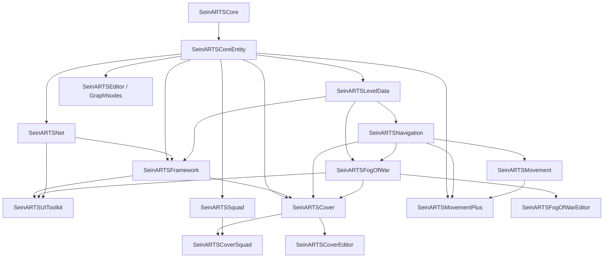

# SeinARTS codebase audit

## Executive verdict

SeinARTS has a strong architectural foundation: the fixed-point simulation boundary is clear, the plugin split is coherent, designer-facing systems are unusually extensible, and the parallel kernels generally follow disciplined compute-in-parallel/apply-serially patterns.

It is not yet production-ready for hostile multiplayer, exact save/restore, reconnect, or determinism certification. The main blockers are concrete correctness defects—not merely missing polish:

- Clients can command entities they do not own and invoke unrestricted match-control commands.
- Effect removal can delete the wrong effect because IDs collide across scopes.
- Snapshots, replays, and StateHash do not cover all future-affecting simulation state.
- Latent actions can invalidate their own iteration through synchronous Blueprint callbacks.
- Several navigation, cover, async-pathing, and FoW cache paths violate declared contracts.
- There is effectively no automated test or CI safety net.

For single-player or trusted manual PIE development, the project is promising and substantially built. For networked shipping, I would address the critical findings before expanding the feature surface.

## Audit scope and limitations

I inspected the live checkout, its manifests and Build.cs files, all project/plugin guidance, recent history, major runtime systems, the current uncommitted movement/navigation diff, and approximately 105,000 lines across 17 plugin modules plus the thin host module.

Important qualifications:

- The checkout already had 11 modified source files and two untracked files, including an in-progress typed-path/arc implementation. I audited that live state, not clean `main`.
- I made no file changes and did not run a build, because a UE build would write intermediates and violate the requested read-only scope.
- I found no Unreal Automation tests, test module, source specs, or `.github` CI.
- I cannot access unpublished historical Claude conversations. I used the four plugin `CLAUDE.md` guides, root guidance, recent git history, and live code as the available handoff record.
- Static analysis can identify defects, but it cannot satisfy this project’s own determinism oracle. No serial-versus-parallel StateHash run, replay comparison, or multi-peer PIE test was performed.

The Codex documentation migration is incomplete: root [AGENTS.md](<D:/Projects/Unreal Engine/SeinARTS/AGENTS.md:1>) points to plugin-level `AGENTS.md` files that do not exist; the detailed plugin instructions remain named `CLAUDE.md`.

## Project description

SeinARTS is a UE 5.7, designer-first deterministic lockstep RTS framework:

- Simulation uses 32.32 fixed-point math, generational entity handles, fixed ticks, and a deterministic PRNG.
- Unreal provides presentation, authoring, input, networking transport, and Blueprint execution.
- Data flows sim → render through the entity bridge; player intent returns through the command buffer.
- Blueprint actor classes define units through generic `FInstancedStruct` component payloads.
- Abilities, effects, formations, broker resolution, movement policies, and major algorithm implementations are replaceable or Blueprint-extensible.
- Extension plugins add squads, cover, and advanced movement without requiring the core framework to depend back on them.

That is the right overall shape for a reusable RTS framework.

## Dependency graph

Arrows below mean “provider → consumer.”

Plugin-level topology is clean in principle:

- Framework is the base.
- Squad and Movement+ require Framework.
- Cover requires Framework.
- Cover marks Squad optional, but `SeinARTSCoverSquad` hard-links `SeinARTSSquad`, so that optionality is not source-build real.

## Module breakdown

| Area | Modules | Responsibility |
|---|---|---|
| Deterministic primitives | `SeinARTSCore` | Fixed point, vector/quaternion math, geometry, time, deterministic PRNG |
| Simulation spine | `SeinARTSCoreEntity` | Entity pool, generic storage, systems, abilities, effects, resources, production, commands, collision, match flow, snapshots, actor bridge |
| World data | `SeinARTSLevelData` | Canonical baked data and extension layer providers |
| Navigation | `SeinARTSNavigation` | Navigation abstraction, grid A*, path requests, typed segments, reachability and placement |
| Movement | `SeinARTSMovement` | Move actions, persistent movement objects, steering, avoidance, collision integration |
| Visibility | `SeinARTSFogOfWar` | Vision grids, LOS, blockers, explored state |
| Networking | `SeinARTSNet` | Turn aggregation, relay transport, lobby, replay, disconnect/desync handling |
| Gameplay shell | `SeinARTSFramework` | Controller, input, camera, targeting, preview, match bootstrap |
| UI | `SeinARTSUIToolkit` | Viewmodels, widget pools, minimap, lobby UI |
| Core authoring | `SeinARTSEditor`, `SeinARTSGraphNodes`, `SeinARTSFogOfWarEditor` | Validators, custom nodes, details panels and debug authoring |
| Squads | `SeinARTSSquad` | Persistent squads, formation dispatch, reinforcement |
| Cover | `SeinARTSCover`, `SeinARTSCoverEditor`, `SeinARTSCoverSquad` | Providers, snapping, cover-aware dispatch and authoring |
| Advanced movement | `SeinARTSMovementPlus` | Infantry, wheeled, tracked, hover and flight modes |

The host `SeinARTS` module is intentionally thin.

## Architectural strengths

Several parts are notably good:

- The sim/render boundary and generational handles establish a sound lockstep foundation.
- Component storage accepts native and designer-defined deterministic structs, giving designers meaningful schema extensibility.
- System scheduling has a total deterministic order: phase, priority, then lexical name.
- Abilities/effects provide broad Blueprint lifecycle hooks without requiring each feature to become a core C++ command.
- Formation and broker resolution share meaningful preview/commit computation.
- Navigation, movement, FoW, avoidance and collision use replaceable implementation classes.
- The audited A*, parallel collision and FoW kernels use per-worker or immutable input state and serial result application; I did not find an obvious data race in those kernels.
- The project already has useful console diagnostics, configuration fingerprints, StateHash tooling, replay plumbing, and debug visualizers.

The architecture is strongest at vertical replacement—“choose one navigation/avoidance/FoW implementation.” It is weaker at horizontal composition—“allow several independent extensions to contribute ordered policies.”

## Critical and high-severity findings

### 1. Critical: multiplayer authority is incomplete

The server correctly overwrites the caller-supplied `PlayerID`, but it trusts entity handles and payloads. `BrokerOrder` filters foreign members, while ordinary `ActivateAbility`, `CancelAbility`, and `CancelProduction` commands only validate that the entity exists. A client can therefore control or cancel an enemy entity; cancelling enemy production removes its queue entry and refunds the attacker’s player state.

Start, end, pause, resume, concede, and restart commands are processed before normal filters and have no host/role authorization. Arbitrary turn IDs and command arrays are also accepted without a bounded past/future window. See [SeinNetSubsystem.cpp](<D:/Projects/Unreal Engine/SeinARTS/Plugins/SeinARTSFramework/Source/SeinARTSNet/Private/SeinNetSubsystem.cpp:987>) and [SeinWorldSubsystem.cpp](<D:/Projects/Unreal Engine/SeinARTS/Plugins/SeinARTSFramework/Source/SeinARTSCoreEntity/Private/Simulation/SeinWorldSubsystem.cpp:527>).

This needs a centralized server-side command authorization layer covering:

- Sender role and match-state permission.
- Entity ownership or explicit shared-control policy.
- Payload shape and size.
- Turn window and monotonicity.
- Command-specific targets, especially cancellations and refunds.

### 2. Critical: effect removal can delete the wrong effect

Instance effects have a per-entity counter beginning at 1. Class/player effects use a separate per-player counter, also beginning at 1. Removal accepts only `(Target, EffectInstanceID)` and searches Instance first, then Class, then Player.

Consequently, expiring class effect `1` can remove unrelated instance effect `1`, leaving the intended scoped effect alive. Timed expiry, instant effects and source-death cleanup all use the ambiguous path. Ownership transfer creates another failure: scoped removal derives the target’s current owner rather than remembering the storage owner. See effect allocation and removal in [SeinWorldSubsystem.cpp](<D:/Projects/Unreal Engine/SeinARTS/Plugins/SeinARTSFramework/Source/SeinARTSCoreEntity/Private/Simulation/SeinWorldSubsystem.cpp:3024>) and [SeinWorldSubsystem.cpp](<D:/Projects/Unreal Engine/SeinARTS/Plugins/SeinARTSFramework/Source/SeinARTSCoreEntity/Private/Simulation/SeinWorldSubsystem.cpp:3230>).

Effect identity should include scope and owning storage, or use a globally unique deterministic ID.

### 3. Critical for save/reconnect: snapshots are not exact simulation continuations

Snapshot restore reconstructs ability and resolver pools—older documentation saying otherwise is stale—but it deliberately cancels latent execution and resets active abilities. It also omits or mishandles:

- Pending commands, pending effect applications and pending destruction.
- Entity tag base state/refcounts and the tag index.
- Named entities, votes and pause state.
- Persistent movement UObject state and nav async queues/results.
- FoW explored/visible/source state.
- AI controller state.
- Component storage types present now but absent from the older snapshot.
- Free entity-slot generations, capacity and exact free-list order.
- Non-UPROPERTY effect counters.

Capture/restore is in [SeinWorldSubsystem.cpp](<D:/Projects/Unreal Engine/SeinARTS/Plugins/SeinARTSFramework/Source/SeinARTSCoreEntity/Private/Simulation/SeinWorldSubsystem.cpp:2189>); latent execution is discarded at [SeinWorldSubsystem.cpp](<D:/Projects/Unreal Engine/SeinARTS/Plugins/SeinARTSFramework/Source/SeinARTSCoreEntity/Private/Simulation/SeinWorldSubsystem.cpp:2404>). Entity-pool reconstruction zeroes missing generations and synthesizes a free list in [SeinEntityPool.cpp](<D:/Projects/Unreal Engine/SeinARTS/Plugins/SeinARTSFramework/Source/SeinARTSCoreEntity/Private/Core/SeinEntityPool.cpp:184>).

A restored game can therefore hash equal immediately, then diverge on the next spawn, effect application, visibility query or movement tick.

### 4. High: latent callbacks can invalidate the active-action iterator

`TickAll` and cancellation methods range-iterate the live `ActiveActions` array. A move completion/cancellation synchronously broadcasts into Blueprint; that continuation can start another latent action, append to the same array, reallocate it, and invalidate the active range loop. See [SeinLatentActionManager.cpp](<D:/Projects/Unreal Engine/SeinARTS/Plugins/SeinARTSFramework/Source/SeinARTSCoreEntity/Private/Abilities/SeinLatentActionManager.cpp:23>).

This is a credible crash/use-after-invalidation path. The manager needs snapshot-and-drain or deferred registration/cancellation, similar to the command buffer’s existing discipline.

### 5. High assurance gap: StateHash is neither complete nor canonically cross-process

The current StateHash omits ability/resolver runtime state, latent actions, movement UObject state, FoW, nav async state, pending commands/effects, free allocator state, and entity tag refcounts. Broker capability/order structures are often count-only because their nested structs lack reflected hash support. Generic component-local `FFixedRandom` and the instance-effect counter are non-UPROPERTY and invisible.

The hash also uses `GetTypeHash(FName)` for names, tags, properties and classes. UE 5.7 hashes the internal name-pool index, not canonical string content, so separate processes with different name load order can report false desyncs. See [ComputeStateHash](<D:/Projects/Unreal Engine/SeinARTS/Plugins/SeinARTSFramework/Source/SeinARTSCoreEntity/Private/Simulation/SeinWorldSubsystem.cpp:3641>), [component hashing](<D:/Projects/Unreal Engine/SeinARTS/Plugins/SeinARTSFramework/Source/SeinARTSCoreEntity/Public/Simulation/ComponentStorage.h:226>) and UE’s [NameTypes.h](<C:/Program Files/Epic Games/UE_5.7/Engine/Source/Runtime/Core/Public/UObject/NameTypes.h:1350>).

This does not prove identical-start peers currently diverge. It means matching hashes are not sufficient evidence of identical future state, while differing hashes can potentially be false positives across processes.

### 6. High: destination preview/commit invariants are violated downstream

The shared resolver does submit the intended first destination, but downstream A* may:

- Return a best-heuristic partial endpoint for blocked, unreachable or capped searches.
- Push the destination away from walls.
- Allow cover slots only under conditional adjacency logic.
- Later unconditionally restore an authoritative endpoint even when the partial endpoint is far away, potentially producing a final blocked segment.

These behaviors occur after preview and directly conflict with the root rule that reachability resolution happens once in shared preview/commit logic. See [SeinNavigationAStar.cpp](<D:/Projects/Unreal Engine/SeinARTS/Plugins/SeinARTSFramework/Source/SeinARTSNavigation/Private/SeinNavigationAStar.cpp:2226>) and its destination push at [SeinNavigationAStar.cpp](<D:/Projects/Unreal Engine/SeinARTS/Plugins/SeinARTSFramework/Source/SeinARTSNavigation/Private/SeinNavigationAStar.cpp:2606>).

Cover has a related direct violation: designer-authored slots are filtered through dynamic passability before snapping or authority recognition, so a slot over a coarse-bake false negative is discarded. See [SeinCoverDefault.cpp](<D:/Projects/Unreal Engine/SeinARTS/Plugins/SeinARTSCoverExtension/Source/SeinARTSCover/Private/System/SeinCoverDefault.cpp:513>).

### 7. High: async repath results can be lost

Async path requests return `Throttled`. Results are cleared on the next queue drain, while interval/off-path repaths interpret `Throttled` as “wait a full interval.” Another requester can drain, compute the original result, and clear it again before the original unit polls.

The comments claim callers retry the next tick, but repath callers explicitly do not. See [SeinNavigationSubsystem.cpp](<D:/Projects/Unreal Engine/SeinARTS/Plugins/SeinARTSFramework/Source/SeinARTSNavigation/Private/SeinNavigationSubsystem.cpp:332>), its drain at [SeinNavigationSubsystem.cpp](<D:/Projects/Unreal Engine/SeinARTS/Plugins/SeinARTSFramework/Source/SeinARTSNavigation/Private/SeinNavigationSubsystem.cpp:449>), and [SeinMoveToAction.cpp](<D:/Projects/Unreal Engine/SeinARTS/Plugins/SeinARTSFramework/Source/SeinARTSMovement/Private/Actions/SeinMoveToAction.cpp:476>).

Use explicit request IDs and separate `Queued`, `Pending`, `Ready`, `NotFound` and `BudgetDeferred` states. Results should remain until consumed or cancelled.

### 8. High: nav and FoW correctness depend on collision-prone hashes

Navigation XORs every blocker field independently. Two blockers swapping positions/shapes can retain the same aggregate hash, after which A* may reuse stale overlay bytes. See [SeinNavigationAStar.cpp](<D:/Projects/Unreal Engine/SeinARTS/Plugins/SeinARTSFramework/Source/SeinARTSNavigation/Private/SeinNavigationAStar.cpp:764>).

FoW uses the same association-losing strategy. Its dynamic-blocker fingerprint additionally omits rotation even though stamping uses rotation. A rotating rectangular blocker can rebuild the overlay while failing to invalidate stationary-source visibility caches. See [SeinFogOfWarDefault.cpp](<D:/Projects/Unreal Engine/SeinARTS/Plugins/SeinARTSFramework/Source/SeinARTSFogOfWar/Private/Default/SeinFogOfWarDefault.cpp:458>) and [SeinFogOfWarDefault.cpp](<D:/Projects/Unreal Engine/SeinARTS/Plugins/SeinARTSFramework/Source/SeinARTSFogOfWar/Private/Default/SeinFogOfWarDefault.cpp:1144>).

Hash each complete record, canonicalize record order, and preferably retain a revision or exact equality guard rather than trusting a 32-bit hash as a correctness key.

### 9. High: several network lifecycle bugs can stall or silence lockstep

- A failed command submission moves and clears pending commands, ignores the returned `false`, and still advances `LastSubmittedTurn`; the turn is never resent. See [SeinNetSubsystem.cpp](<D:/Projects/Unreal Engine/SeinARTS/Plugins/SeinARTSFramework/Source/SeinARTSNet/Private/SeinNetSubsystem.cpp:849>).
- World cleanup resets ordinary turn state but not hash reports, completed hash checks, last-reported turn, or the desync flag. A new map can suppress gossip until it exceeds the previous match’s turn count. See [SeinNetSubsystem.cpp](<D:/Projects/Unreal Engine/SeinARTS/Plugins/SeinARTSFramework/Source/SeinARTSNet/Private/SeinNetSubsystem.cpp:119>).
- Completed turn/hash sets grow for the session despite comments about pruning.
- Replay and turn submissions are retained in memory without strong bounds.

### Other confirmed correctness/lifetime defects

- Free-rotation building validation ignores captured yaw and validates rectangular footprints at yaw zero. [SeinWorldSubsystem.cpp](<D:/Projects/Unreal Engine/SeinARTS/Plugins/SeinARTSFramework/Source/SeinARTSCoreEntity/Private/Simulation/SeinWorldSubsystem.cpp:699>)
- Collision overlap identity keys use entity indices but not generations, suppressing End/Begin when a slot is recycled. [SeinCollisionResolver.h](<D:/Projects/Unreal Engine/SeinARTS/Plugins/SeinARTSFramework/Source/SeinARTSCoreEntity/Public/Collision/SeinCollisionResolver.h:199>)
- Same-cell A* routes can contain one waypoint and zero typed segments, causing vehicle modes to complete without reaching a destination outside acceptance. [SeinMoveToAction.cpp](<D:/Projects/Unreal Engine/SeinARTS/Plugins/SeinARTSFramework/Source/SeinARTSMovement/Private/Actions/SeinMoveToAction.cpp:295>)
- Flight promises continuous minimum-speed movement but inherits idle coast-to-zero and ground collision. It also computes steering/bank state while applying yaw-only rotation. [SeinFlightMovement.cpp](<D:/Projects/Unreal Engine/SeinARTS/Plugins/SeinARTSMovementPlusExtension/Source/SeinARTSMovementPlus/Private/Movement/SeinFlightMovement.cpp:98>)
- Generic component removal calls `ClearScriptStruct` and then `InitializeStruct`; UE’s clear already destructs and reconstructs. The second initialization is an invalid lifecycle with leak/UB potential for nontrivial payloads. [ComponentStorage.h](<D:/Projects/Unreal Engine/SeinARTS/Plugins/SeinARTSFramework/Source/SeinARTSCoreEntity/Public/Simulation/ComponentStorage.h:158>)
- Eight editor textures are `AddToRoot`’d but never removed during module shutdown, leaking across live-coding/module reload cycles. [SeinARTSEditorStyle.cpp](<D:/Projects/Unreal Engine/SeinARTS/Plugins/SeinARTSFramework/Source/SeinARTSEditor/Private/SeinARTSEditorStyle.cpp:240>)
- Class/player effect ticking iterates an unsorted `TMap`. This is a conditional determinism risk when simultaneous Blueprint hooks mutate shared state or consume the global PRNG.
- The no-bake FoW fallback derives sim inputs from floating-point world traces. It should be a hard multiplayer startup failure, not a permissive fallback.
- Fixed-point extreme-value operations contain signed-overflow/shift UB hazards. Normal RTS coordinate ranges probably avoid them, but fuzz/property tests should define the safe numeric envelope.

## Performance and inefficiency assessment

### Highest-value optimization: eliminate redundant per-tick StateHash

A full reflection walk is computed every networked simulation tick because the network turn resolver is bound, even though no code consumes `FSeinStateHashSystem::LastHash`. Net computes a second hash independently only on gossip turns; debug logging can compute a third. See [SeinStateHashSystem.h](<D:/Projects/Unreal Engine/SeinARTS/Plugins/SeinARTSFramework/Source/SeinARTSCoreEntity/Private/Simulation/Systems/SeinStateHashSystem.h:22>).

Cache one canonical hash per tick on demand, or compute only at configured checkpoints.

### A* scratch allocation pressure

Each `FAStarScratch` holds about 15 bytes per grid cell across seven grid-sized arrays. At one million cells that is approximately 15 MB per context before heap/path capacity. The serial scratch persists, but parallel batch contexts are locally created and destroyed each batch, producing substantial allocation churn and peak memory. See [SeinNavigationAStar.h](<D:/Projects/Unreal Engine/SeinARTS/Plugins/SeinARTSFramework/Source/SeinARTSNavigation/Public/SeinNavigationAStar.h:83>) and [SeinNavigationAStar.cpp](<D:/Projects/Unreal Engine/SeinARTS/Plugins/SeinARTSFramework/Source/SeinARTSNavigation/Private/SeinNavigationAStar.cpp:2538>).

Use a bounded persistent worker-scratch pool.

### FoW scaling ceiling

Changed-source footprint generation is explicitly O(R³): O(R²) candidate cells with O(R) LOS rays. Stationary caching and parallelization are good, but large moving armies with high vision radii remain expensive.

At one million cells:

- Normal visibility alone is roughly 3 MB per player.
- All seven visibility layers are roughly 15 MB per player.
- Source footprint arrays and history add more.

Long term, consider symmetric shadowcasting or another field algorithm, shared team grids, and coarser update cadence.

### Minimap workload

The minimap scans the full entity pool every sim tick. Its default 256² fog texture performs 65,536 individual visibility queries and a full upload every four sim ticks—about 491,000 queries and 1.9 MB of raw texel uploads per second at 30 Hz, before resource overhead.

A bulk observer-grid API already exists; resample that once, retain buffers, and update only dirty regions.

### Cover, squad, avoidance and collision

- Cover performs flat provider scans, repeated provider lookups, and quadratic dedup: approximately `O(P + S·P + S²)`.
- Squad tick repeatedly scans entities/members and rebuilds formation information in a roughly 570-line tick.
- Avoidance’s main kernel is over 1,000 lines and allocates several maps/arrays and per-entity neighbor collections.
- Collision builds and sorts nested collections each tick.

These need trace scopes and representative stress captures before structural optimization. The absence of profiler scopes makes current optimization judgment largely static.

### Memory growth

- ReplayWriter retains the entire turn/command history until recording ends; long matches have unbounded RAM and crash-loss exposure.
- Completed turn/hash sets grow for a session.
- Editor rooted textures leak across reloads.
- A* worker scratch churn produces large transient memory peaks.

## API completeness and extensibility

### Strong seams

The project is genuinely extensible in:

- Component schemas.
- Custom system registration.
- Abilities and effects.
- Formations and broker dispatch.
- Movement policy and full-tick implementations.
- Navigation/FoW/avoidance/collision class replacement.
- Level-data providers.
- Squad, cover and movement extension packaging.

### Important incompleteness

- **Command dispatch is closed.** Command tags/payloads look open, but execution is a hardcoded `if/else` chain; unknown tags are rejected. New command families require core edits.
- **Target gestures are only partly extensible.** Only Point and Point+Facing exist, and drag recognition hardcodes the latter. Line, cone, paint, chain and multistage targeters require core state-machine changes.
- **Attribute modifiers support only `FFixedPoint`.** Boolean, integer, enum and vector attributes cannot use the modifier stack.
- **Public dependency declarations are incorrect in several modules.** Public headers expose types from modules declared private, forcing downstream consumers to discover and redeclare hidden dependencies.
- **Cover’s Squad dependency is not truly optional.**
- **Terrain ownership is misplaced.** FoW and Cover query terrain through Navigation even though LevelData owns it.
- **Single-cast delegates inhibit composition.** Cover, hazards, objectives and future extensions cannot independently contribute ordered destination/placement policies.
- **Level-data channels lack provider GUIDs, schema versions and duplicate-ID validation.**
- **Typed paths remain closed.** The current WIP adds Arc and Jump but no extension payload/link identity. Invalid chains/radii/sweeps are not strongly validated.
- **Per-unit terrain restrictions are not wired.** Path requests support blocked terrain tags, but ordinary movement does not author/pass them consistently and A* reachability ignores its agent-tag input.
- **FoW lifecycle hooks are advertised but never called.**
- **Some Blueprint metadata overpromises.** For example, the faction service is Blueprintable but its policy methods are not Blueprint events.
- **Horizontal provider composition and deterministic ordering need a common pattern.**

So the answer to “fully pluggable and handles all reasonable use cases” is: broadly capable, but not yet. Core RTS composition is strong; mod/plugin composition, rich targeting, exact persistence, custom command families and advanced path semantics are incomplete.

## Features needing further work

In priority order:

1. Secure and bounded lockstep command ingestion.
2. Exact snapshot/reconnect with command-tail catch-up.
3. Replay initialization, compatibility enforcement, checkpoints, seeking, final-hash validation and periodic disk flush.
4. Navigation destination-contract cleanup and durable async requests.
5. Vehicle planning: a real deterministic Reeds-Shepp/Dubins producer, same-cell handling, typed-path validation and curve-aware consumption.
6. Flight idle loiter/continue-forward behavior, visible bank, and real 3D avoidance.
7. Cover occupancy/reservations and deterministic min-cost matching; separate authoring authority from coarse-nav validation.
8. Line/cone/paint/multistage targeters and native client footprint validation.
9. Team/allied FoW aggregation and a scalable visibility algorithm.
10. Multiple production lanes/bays, repeat queues and output routing where the target games need them.
11. Stable reinforcement slot IDs rather than “first gameplay tag” identity.
12. Automatic adaptive input delay and clearer drop/reconnect product behavior.

The current uncommitted Arc/Jump work is a useful seam extension, but it should be treated as WIP: no concrete curve producer exists yet, and this audit did not compile or run it.

## Testing and verification gap

The project’s most serious systemic weakness is not a particular algorithm—it is the lack of automated evidence for its declared invariants.

The first test suite should cover:

1. Serial `Sein.Sim.Parallel 0` versus parallel `1` state equivalence.
2. Snapshot round-trip, immediate canonical digest, then next-N-tick equivalence.
3. Replay golden scenarios with final full-state digest.
4. Enemy-command, global-control, malformed-turn and oversized-payload authorization tests.
5. Instance/class/player effect ID collision and ownership-transfer cases.
6. Latent completion callbacks that immediately launch new actions.
7. Async path budget/repath stress.
8. Preview versus first-request destination equality, including cover slots.
9. Blocker permutations, duplicate blockers and rotation-only invalidation.
10. Entity-generation reuse for pool and collision overlap behavior.
11. Framework-only and every extension combination compile matrix.
12. External consumer modules compiling against each advertised public module.

A 128- or 256-bit canonical state digest should supplement the current 32-bit hash for authoritative test evidence.

## Out-of-the-box ideas

- **Determinism ledger:** require every sim-affecting subsystem to register `Hash`, `Capture`, `Restore`, `Reset`, `ValidateConfig` and a stable schema ID. One registry would make omissions visible instead of relying on handwritten world-subsystem lists.
- **Immutable resolved-order plan:** preview produces a deterministic per-member plan containing destinations, authority and formation identity; commit submits that exact artifact. Navigation cannot reinterpret its first destination.
- **Shadow-world oracle:** a headless test runs the same command stream in serial and parallel worlds, periodically restores a checkpoint into a third world, and compares canonical digests for the next N ticks.
- **Request-token navigation:** replace requester-keyed async state with monotonic deterministic request IDs, durable result mailboxes and explicit cancellation.
- **Content contract compiler:** at cook/startup, fingerprint class paths, provider order, layer schemas, gameplay tags, movement/nav classes and plugin combinations using canonical strings rather than `FName` indices.
- **Rolling replay journal:** append checksum-framed chunks to disk and insert periodic exact checkpoints. This provides seeking, bounded memory and crash recovery almost for free.
- **Tactical cover allocator:** treat cover slots as deterministic reservable resources and solve assignment as min-cost matching rather than greedy local choice.
- **Performance budgets as API:** add Unreal Insights scopes plus per-tick counters for paths, expanded nodes, FoW rays, avoidance pairs, cover candidates and UI invalidations.

## Recommended order of operations

1. Fix command authority, effect identity, latent mutation and failed turn submission.
2. Fix async path lifecycle, destination/cover invariants and nav/FoW cache keys.
3. Define the canonical state ledger and rebuild hash/snapshot/replay around it.
4. Add the determinism, security and plugin-matrix tests before further sim-spine work.
5. Instrument real scenarios, then address StateHash, A* scratch, FoW and minimap costs.
6. Close API/dependency seams.
7. Resume advanced vehicle, cover and targeting features.

Ultra was appropriate for this baseline audit and remains justified for networking, snapshots, determinism, movement/navigation seams and cross-module changes. It would be excessive for routine local editor/UI cleanup.

No files or build artifacts were changed.
