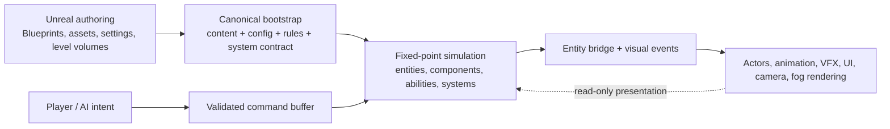
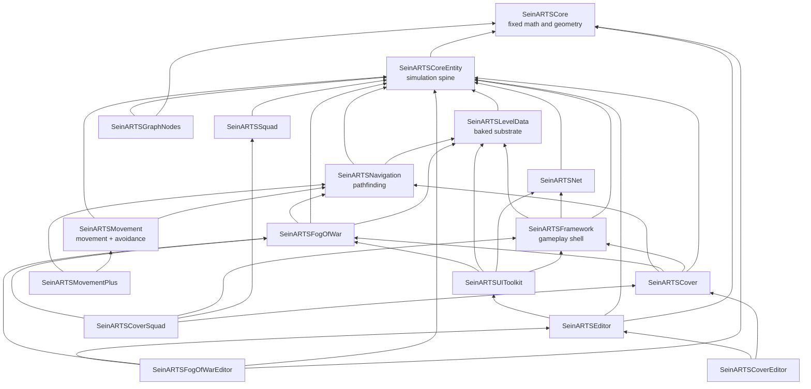
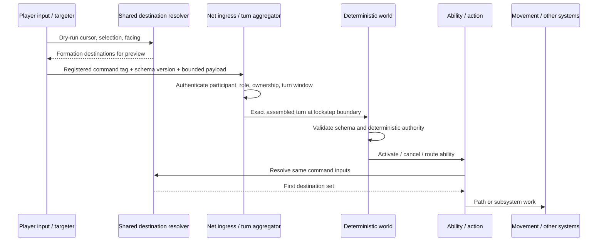

# SeinARTS Framework — Technical Field Guide

**Code baseline:** `219f586` (`fable-performance-audit`, 2026-08-01)

**Purpose:** owner refresh, architectural map, and confidence reference

**Source hierarchy:** live code first; project/plugin guidance second; audit ledgers and engineering notes third

---

## 1. How to use this guide

This document answers four different questions that are easy to blur together in a large framework:

1. **What product is SeinARTS trying to be?**
2. **What is implemented and usable now?**
3. **How does the implementation actually work?**
4. **Where are the remaining limits, risks, and deliberate design gates?**

It is written as a field guide, not as a chronological audit diary. Start with sections 2–6 to rebuild the mental model. Use sections 7–20 as subsystem references. Sections 21–25 explain the cross-cutting algorithms, safety model, multiplayer flows, extension rules, and known gaps.

### Confidence labels used here

| Label | Meaning |
|---|---|
| **Shipped** | The path exists in production code and is part of the current runtime. |
| **Active here** | The host project selects or enables it in `Config/DefaultGame.ini`; another consumer can choose differently. |
| **Seam** | A supported interface or extension point exists, but the framework may ship only a reference implementation. |
| **Approved, unbuilt** | Product direction is agreed, but implementation is not present. |
| **Gated** | A product/API decision is intentionally still open. |
| **Known issue** | The live audit has confirmed a defect, incompleteness, or scaling problem. |

The most important reading rule is: **a seam is not the same thing as a finished feature**. For example, typed path segments support arcs, custom movement classes exist, and Movement+ now emits a bounded set of Reeds–Shepp-style maneuvers; that still does not mean SeinARTS contains a complete globally optimal Reeds–Shepp or Dubins solver.

---

## 2. The north star

SeinARTS is intended to make a multiplayer-ready RTS feel native to Unreal Engine without making Unreal's ordinary actor tick, floating-point transforms, replication order, or Blueprint VM timing the authority over gameplay.

The north star can be stated compactly:

> **A AAA RTS development experience native in Unreal Engine, backed by an exact deterministic simulation that is modular enough for genre-specific games, multiplayer matches, replay, reconnect, and eventually co-op campaigns.**

That goal creates six design obligations.

1. **Designer-first authoring.** A designer should create a unit as an Unreal Blueprint, add deterministic component payloads in the Details panel, author abilities/effects in Blueprint, choose movement and policy classes in Project Settings, and use normal editor visualizers.
2. **One authoritative simulation.** Gameplay truth lives in fixed-point entity/component state. Unreal actors, widgets, materials, cameras, and animation present that truth; they do not independently decide it.
3. **Multiplayer by construction.** Commands, configuration, content identities, system ordering, random streams, snapshots, and state comparison all have canonical contracts. Multiplayer is not a later replication layer bolted onto a single-player actor game.
4. **Pluggable policy, frozen contract.** Navigation, avoidance, collision resolution, formations, command brokering, authority, fog, squad dispatch, and other policies can be swapped. Once a match starts, the selected implementations and their relevant state contracts are frozen.
5. **Opt-in genre depth.** The base framework remains useful without squads, cover, or specialized movement. Extension plugins add those opinions through one-way dependencies.
6. **Honest failure.** Missing command schemas, incompatible content, uncovered persistent state, malformed network data, or post-bootstrap configuration mutation should stop or reject the operation instead of permitting a silent divergence.

### What “Unreal is the renderer” actually means

This phrase does **not** mean the framework avoids Unreal. It means Unreal owns the development surface and presentation layer while the deterministic world owns gameplay truth.



The sanctioned actor bridge is `USeinEntityComponent` on `ASeinActor`. It carries authored component data into the simulation at spawn and later mirrors deterministic state outward. Input returns through commands; arbitrary actor-side mutation is not a second gameplay lane.

---

## 3. What exists now — capability reality matrix

| Capability | Current reality | Important boundary |
|---|---|---|
| Fixed-step deterministic world | **Shipped** | 32.32 fixed point, deterministic PRNG, stable system order, canonical state roots. |
| Blueprint-authored entities/components | **Shipped** | Custom deterministic structs are validated; arbitrary Blueprint latent VM frames are not exactly persistable yet. |
| Ability/effect framework | **Shipped** | Move, production, reinforce, etc. use abilities and latent actions; some direct ability lifecycle paths do not centrally maintain active-ID fields. |
| Commands and authority | **Shipped** | Exact tag + schema registry, bounded payloads, owner/scoped-grant policy, role separation, fail-before-tick-zero manifest checks. |
| Grid navigation | **Shipped** | Weighted footprint-aware A*, dynamic blockers, projections, partial paths, smoothing, async batch option. Initial-destination relocation and dropped async repath results remain known issues. |
| Unit movement and avoidance | **Shipped** | Basic movement, pluggable planner/mover handles, local avoidance, idle re-seek, and formations. The mover's public `Velocity`/`GroundSpeed` remains pre-body-collision; collision-inclusive displacement is sampled separately. Behavior still requires PIE judgment. |
| Collision | **Shipped** | Serial Gauss–Seidel and deterministic Jacobi-style parallel resolver. This host actively chooses Jacobi. |
| Vehicle/flight movement modes | **Shipped in Movement+** | Infantry, wheeled, tracked, hover, flight policies exist. Wheeled/tracked use a curated Reeds–Shepp-style candidate ladder, not a complete optimal-family solver. Fixed-wing continuous-flight policy is still gated. |
| Level bake/substrate | **Shipped** | Unified level-volume bake and runtime adoption. Level Data's own exact persistence coverage claim remains incomplete. |
| Fog of war | **Shipped** | Per-player/layer grids, explored memory, height-aware Bresenham LOS, static/dynamic blockers, shapes, actor visibility and rendering. The default algorithm and invalidation have known correctness/performance issues. |
| Formations and command brokers | **Shipped** | Shared preview/commit resolver path and multiple built-in formations. A confirmed initial-path invariant breach remains downstream. |
| Persistent squads | **Shipped extension** | Squad entity, authored slots, leader promotion, reinforcement, dispatch, cohesion/blob behavior. |
| Cover | **Shipped extension, tactically incomplete** | Provider geometry, slots, qualities, visibility gating, cover-aware broker/squad dispatch. Stable reservations and global matching are approved but unbuilt. |
| Lockstep multiplayer | **Shipped** | Unreal relay, bounded turn aggregation, protocol validation, root checks, lobby/bootstrap consensus, disconnect policies. Threat model is authenticated fail-stop peers, not Byzantine consensus or anti-DoS. |
| Same-slot reconnect/catch-up | **Shipped (FEAT-01)** | Coordinator-served checkpoint + exact opaque command tail + root-gated activation. Stale activation boundaries are rescheduled, but a failed serve needs a fresh request. There is no true multiprocess automated E2E or measured transport ceiling. |
| Long-match replay | **Shipped (FEAT-02)** | V9 append-only checkpointed journal, exact turn bytes, crash-tail recovery, lazy seek, v8 read compatibility, bounded retention. Trusted-local only; pause playback unsupported. |
| New participant membership growth | **Not built** | Existing-slot late adoption is supported; changing the match membership set is FEAT-10 territory. |
| Host migration | **Gated (FEAT-10 / Gate H)** | Checkpoint/turn machinery and stale-term rejection exist, but election, authenticated term/membership transition, ledger/control transfer, and split-brain recovery are unbuilt. |
| Co-op campaign persistence | **Approved, unbuilt (FEAT-11 / Gate I)** | Exact same-schema checkpoints are a foundation, not a campaign save model. Versioned campaign migration, ownership/authentication, participant identity, and cross-map bootstrap remain design work. |
| Performance remediation | **Next workstream** | Audit has confirmed synchronous roots, A* scratch churn, fog costs, broad scans, minimap copies, effect-stack copies, and other hotspots; most are not yet fixed. |

This matrix is the shortest honest answer to “what does the framework really do now?” It is already a substantial deterministic RTS platform, but it is not yet the finished AAA production posture implied by every approved feature row.

---

## 4. Repository and plugin topology

The repository is a UE 5.7 monorepo with a thin host project, four production plugins, and two disabled development-only test plugins.

```text
SeinARTS/
├── Config/ and Content/                 host configuration and sample content
├── Source/SeinARTS/                     thin host game module
├── Docs/Audit/                          readable audit and independent findings
├── Docs/Engineering/                    live engineering ledgers and subsystem notes
└── Plugins/
    ├── SeinARTSFramework/               base framework, 12 modules
    ├── SeinARTSSquadExtension/          persistent squad behavior
    ├── SeinARTSCoverExtension/          cover runtime/editor/squad bridge
    ├── SeinARTSMovementPlusExtension/   specialized movement modes
    ├── SeinARTSTestSuite/               disabled framework/editor tests
    └── SeinARTSExtensionTestSuite/      disabled all-extension tests
```

### Production dependency graph



Dependencies point toward the base. The framework does not include extension headers or branch on extension types. Extensions participate through settings-selected classes, registered systems, component payloads, config contributors, canonical-state providers, and module startup registration.

### Direct Sein module dependencies

This table omits ordinary Unreal modules and shows the direct Sein-facing compile relationships (including private implementation dependencies where they matter):

| Production module | Direct Sein dependencies | Primary responsibility |
|---|---|---|
| `SeinARTSCore` | — | Fixed math, geometry, deterministic random. |
| `SeinARTSCoreEntity` | Core | Entity/component world, commands, abilities, collision, state contracts. |
| `SeinARTSLevelData` | CoreEntity; private Core | Shared baked static substrate. |
| `SeinARTSNavigation` | LevelData, CoreEntity; private Core | Pluggable nav and shipped A*. |
| `SeinARTSMovement` | CoreEntity, Navigation; private Core | MoveTo, policies, avoidance, containment/trace. |
| `SeinARTSFogOfWar` | LevelData, CoreEntity; private Core, Navigation | Authoritative visibility plus render bridge. |
| `SeinARTSNet` | Core, CoreEntity | Lockstep, relay, lobby, resync, replay. |
| `SeinARTSFramework` | Core, CoreEntity; private Net, LevelData | Unreal game/input/camera/preview shell. |
| `SeinARTSUIToolkit` | Core, CoreEntity, Framework; private Net, LevelData, Fog | View models, widgets, lobby and minimap UI. |
| `SeinARTSEditor` | Core, CoreEntity, UI Toolkit | Asset factories, validators, authoring tools. |
| `SeinARTSGraphNodes` | Core, CoreEntity | Typed component K2 nodes; uncooked only. |
| `SeinARTSFogOfWarEditor` | Core, CoreEntity, Fog, Editor | Vision-stamp editor drawing. |
| `SeinARTSSquad` | Core, CoreEntity | Squad entity behavior and dispatch. |
| `SeinARTSCover` | Core, CoreEntity; private Framework, Fog, Navigation | Cover geometry/query and loose-unit resolver. |
| `SeinARTSCoverEditor` | Core, CoreEntity, Cover, Editor | Cover details/visualization. |
| `SeinARTSCoverSquad` | CoreEntity; private Core, Cover, Squad, Framework, Fog | Optional-concept cover/squad dispatch bridge. |
| `SeinARTSMovementPlus` | Core, CoreEntity, Movement; private Navigation | Infantry/vehicle/hover/flight policies. |

There is one known packaging exception: Cover's descriptor calls Squad optional, but the always-declared `SeinARTSCoverSquad` module hard-links `SeinARTSSquad`. Physically stripping Squad while retaining the Cover plugin currently fails to compile. The runtime concepts are decoupled more cleanly than the packaging boundary.

### Test topology

The test plugins are disabled by default, denied in Shipping, and must never become dependencies of production modules. `SeinARTSTestSupport` supplies fixtures; framework/editor test modules exercise the base; extension test modules intentionally link all optional plugins. Test-run receipts and profile floors exist so a truncated or accidentally narrow run cannot masquerade as complete evidence.

---

## 5. Active host configuration versus shipped defaults

The word “default” can mean either the framework class-default object or this repository's active host configuration. They differ intentionally.

| Setting | Framework shipped default | Active in this host | Consequence |
|---|---:|---:|---|
| Simulation rate | 30 ticks/s | 30 ticks/s | One deterministic tick every 1/30 s. |
| Turn rate | 10 turns/s | 10 turns/s | Three simulation ticks per lockstep turn. |
| Input delay | 3 turns | 2 turns | Local intent normally executes about 200 ms later at 10 turns/s, before network/frames. |
| Max catch-up ticks/frame | 5 | 5 | Scheduler bounds frame work; resync uses full bursts while turn data exists. |
| Parallel simulation | `true` | inherited `true` | Eligible passes use deterministic worker execution above batch threshold 64. |
| Async pathfinding | `false` unless configured | `true` | Requests queue and are solved in canonical batches; results become visible on a later tick. |
| Level data | `USeinLevelDataDefault` | same | Baked grid substrate is active. |
| Nav cell size | 100 cm | 50 cm | This host chooses finer routing resolution. |
| Max step height | 50 cm | 50 cm | Vertical neighbor connectivity threshold. |
| Navigation | `USeinNavigationAStar` | same | Shipped weighted A* is active. |
| A* heuristic weight | 125% | 125% | Weighted A*: faster, not guaranteed shortest. |
| A* max iterations | 10,000 | 10,000 | Hard search-work cap; best partial route can result. |
| Path requests/tick | 32 | 32 | Deterministic throughput budget. |
| Collision resolver | serial default / Gauss–Seidel | parallel resolver / Jacobi | Active collision uses frozen-pass Jacobi semantics. Cover authority currently forces its compute loop onto the main thread. |
| Avoidance | `USeinAvoidanceDefault` | same | Lateral steer, yield braking, cohesion, idle resolution. |
| Idle re-seek | off by in-class default | `true` | Displaced idle units can deterministically return to a home/slot. |
| Default formation | Box | Ring | Ordinary single-click/drag orders use Ring here. |
| Single-click formations | `false` | `true` | Plain right-click spreads a selected group. |
| Ordinary broker resolver | plain default | Cover-aware default | Loose-unit destinations may snap to cover slots. |
| Squad dispatch | extension default resolver | Cover-aware squad resolver | Squad slots also prefer eligible cover. |
| Fog class | `USeinFogOfWarDefault` | same | Grid fog is active. |
| Fog cell size | 100 cm | 100 cm | Coarser than active navigation. |
| Fog cadence | every 3 sim ticks | every 3 sim ticks | Authoritative visibility updates at 10 Hz. |
| Fog render cadence | 10 Hz | 10 Hz | Presentation reads separately from simulation cadence. |
| Cover class | extension default | `USeinCoverDefault` | Cover providers and slot queries active. |
| Cover snap radius | extension setting | 500 cm | Cover-aware destinations search within five meters. |
| Networking | enabled | enabled | Lockstep relay/turn gate used in network sessions. |
| Max players | 8 | 8 | Protocol/lobby bound. |
| Root check cadence | every 10 turns | every 10 turns | Canonical roots are compared about once per second. |
| Replay checkpoint cadence | 3,000 turns | inherited | About five minutes at 10 turns/s. |
| Replay turn batch | 64 turns | inherited | About 6.4 seconds per journal turn frame when full. |
| Replay file cap | 16,384 MiB | inherited | Storage policy, deliberately not lockstep-fingerprinted. |

The active 50 cm nav cell is represented in config as raw 32.32 fixed-point (`50 << 32`), while the 100 cm fog cell is `100 << 32`. The raw integers in `.ini` are serialization, not bizarre centimeter values.

The active 30/10 timing divides cleanly. Live code computes ticks-per-turn with truncating integer division and does not presently enforce the documentation's “must divide evenly” rule; a configuration such as 30/8 would actually become three ticks per turn rather than a true 8 Hz turn cadence. That is a validation gap, not a problem in the current host values.

---

## 6. End-to-end mental model

### 6.1 Authoring a unit

A unit type is an `ASeinActor` Blueprint. Its automatically attached `USeinEntityComponent` contains a `TArray<FInstancedStruct>` named `ComponentData`. Each item is a deterministic payload such as identity, extents, movement, abilities, effects, production, containment, vision, or an extension component.

At deterministic spawn:

1. The world allocates an `FSeinEntityHandle` containing an index and generation.
2. The actor bridge's component payloads are copied into reflection-backed component storage.
3. Identity, owner, transform, abilities, tags, and relevant derived registrations initialize in canonical order.
4. The simulation owns the entity thereafter.
5. The actor bridge and presentation systems read the settled simulation result and update the Unreal actor.

The generation prevents a recycled entity slot from being mistaken for the previous occupant. Systems should compare full handles, not just indexes.

### 6.2 Issuing a command



Preview and commit intentionally share the destination computation. The sacred invariant is narrower and more precise than “paths never change”: **the previewed destination must equal the command's first submitted destination for the same input**. Later interval repaths may react to a changed world. The audit still confirms ways the first destination can be moved downstream (`NAV-01`), so this architectural rule is not yet fully enforced by the live implementation.

### 6.3 Running one fixed tick

The scheduler accumulates wall-clock time, but wall-clock pacing is not simulation state. For each permitted fixed tick it:

1. Revalidates the frozen config fingerprint and canonical world-binding frames.
2. At a network-turn boundary, asks whether the exact next assembled turn is ready. If not, it stalls without advancing the tick.
3. Commits any primed replay commands for that exact tick.
4. Enters the fixed-point simulation scope.
5. Runs `PreTick` systems.
6. Advances match/vote state.
7. Runs host-only AI reasoning outside mutation authority; AI may only emit commands.
8. Processes commands and `CommandProcessing` systems.
9. Ticks latent actions and `AbilityExecution` systems.
10. Applies deferred destroys, then runs `PostTick` systems.
11. Emits a replay boundary and read-only settled-tick observer callbacks.

Systems are sorted by phase, then numeric priority, then stable system identity. Equal-priority behavior cannot depend on module startup accident.

### 6.4 Current system order

| Phase | Priority | System responsibility |
|---|---:|---|
| PreTick | 0 | Effect ticking/expiry |
| PreTick | 5 | Collision broadphase |
| PreTick | 6 | Avoidance output |
| PreTick | 7 | Dynamic nav blocker stamping |
| PreTick | 10 | Cooldowns |
| CommandProcessing | — | Core command buffer and any registered phase systems |
| AbilityExecution | 0 | Ability tick system |
| AbilityExecution | 10 | Movement driver |
| AbilityExecution | 50 | Production |
| PostTick | -10 | Lifespan |
| PostTick | 10 | Collision resolution |
| PostTick | 11 | Nav containment |
| PostTick | 30 | Squad maintenance |
| PostTick | 40 | Command broker maintenance |
| PostTick | 80 | Fog stamping |
| PostTick | 90 | Observation-only movement trace diagnostics |

The ordering expresses gameplay semantics. Broadphase and avoidance see the tick-start arrangement; movement proposes motion; collision resolves it; containment enforces nav validity; squads and brokers update group truth; fog sees settled positions; and the optional movement trace diagnoses commanded versus actual post-resolution displacement. The latter does not rewrite `FSeinMovementComponent::Velocity` or feed animation.

---

## 7. Module: SeinARTSCore — deterministic math substrate

**Role:** provide platform-stable numeric, geometry, transform, time, entity-ID, and random primitives without depending on the simulation's higher layers.

**Dependencies:** Unreal `Core` and `CoreUObject` only.

**Core files:**

- `Public/Types/FixedPoint.h`, `Private/Types/FixedPoint.cpp`
- `Public/Types/Vector.h`, `Rotator.h`, `Quat.h`, `Transform.h`
- `Public/Types/Random.h`
- `Public/Math/MathLib.h`, `GeometryQueries.h`, `CollisionQueries.h`
- Shape/value headers under `Public/Types/`

### 7.1 32.32 fixed point

`FFixedPoint` stores a signed 64-bit integer with 32 fractional bits. The mathematical value is `Raw / 2^32`.

- Addition and subtraction operate on raw bits.
- Multiplication uses a 128-bit intermediate and shifts by 32. MSVC uses `_mul128`; Clang uses `__int128`.
- Division uses deterministic 128-by-64 binary long division.
- Overflow behavior is explicitly two's-complement modulo `2^64`; it is not left to signed-overflow undefined behavior.
- Square root uses deterministic Newton–Raphson iteration.
- Trigonometry uses a 1,024-entry quarter-wave sine lookup table plus deterministic symmetry/range reduction.
- `atan` uses a fixed polynomial/range reduction; `asin` is built from `atan2` and `sqrt`; exponent/log helpers use fixed rational or series approximations.

This is the foundation for cross-process agreement. The goal is not infinite precision; it is a stable, documented approximation with identical raw output on every supported peer.

### 7.2 Deterministic random

`FFixedRandom` uses Xorshift128+ with SplitMix64 seeding. It supports bounded values, vector sampling, and Fisher–Yates shuffle. Rejection sampling is used for circle/sphere distributions so there is no platform float dependency.

Randomness is deterministic only when the stream's seed and consumption order are deterministic. A system that iterates an unordered container and consumes one random value per element can still desync. That is why stable iteration rules matter just as much as the generator.

### 7.3 Geometry

The module supplies fixed-point vectors, rays, planes, spheres, capsules, boxes, bounds, transforms, quaternions, and collision/geometry helpers. Higher modules use these instead of `FVector`, `FQuat`, `FMath`, or UE physics inside authoritative code.

### 7.4 Boundary rule

Conversions between Unreal floats and fixed point exist for authoring, rendering, debug drawing, and actor bridging. They are not acceptable as authoritative in-tick computation. Editor-time traces may use Unreal floats if the result is quantized and baked into deterministic data before a match.

---

## 8. Module: SeinARTSCoreEntity — simulation spine

**Role:** own the deterministic world, entity/component storage, commands, abilities, effects, players, resources, formations, collision, serialization, snapshotting, configuration contracts, and core Blueprint API.

**Dependencies:** `SeinARTSCore` plus UE core/engine, settings, gameplay tags, and asset-registry facilities. It deliberately reaches later modules through soft class paths and delegates instead of hard dependencies.

**Highest-leverage files:**

- `Public/Simulation/SeinWorldSubsystem.h`
- `Private/Simulation/SeinWorldSubsystem.cpp`
- `Public/Core/SeinEntityPool.h`, `Private/Core/SeinEntityPool.cpp`
- `Public/Core/SeinTickPhase.h`, `SeinSystemPriority.h`, `SeinSimContext.h`
- `Public/Actor/SeinActor.h`, `SeinEntityComponent.h`
- `Public/Input/SeinCommand.h`, `SeinCommandSchemaRegistry.h`, `SeinCommandAuthorityPolicy.h`
- `Public/Abilities/SeinAbility.h`, `SeinLatentActionManager.h`
- `Public/Effects/SeinEffect.h`, `Public/Components/SeinActiveEffectsComponent.h`
- `Public/Serialization/*`, `Public/Data/SeinWorldSnapshot.h`
- `Public/Settings/PluginSettings.h`

### 8.1 Entity/component model

The world uses an entity pool plus type-indexed component storages. Entity handles carry `{Index, Generation}`. Payload components are deterministic USTRUCT data. Logic is separated into systems, abilities, effects, AI controllers, broker resolvers, and policy objects.

One naming wrinkle is worth making explicit. `SeinARTSCore` still supplies the minimal `FSeinEntity` slot payload (transform and flags), but its embedded `FSeinID` field is legacy and is deliberately left invalid by the live pool. Authoritative identity is the generational `FSeinEntityHandle` owned by `SeinARTSCoreEntity`; new gameplay code should never recover identity from `FSeinEntity::ID`.

Slot zero is invalid. Freed slots enter a LIFO free list, and reuse increments the generation. A slot that reaches the maximum generation is permanently retired instead of risking an eventual ABA-style handle collision. Pool iteration is ascending slot order; snapshots preserve capacity, live/retired state, generation, and free-list order exactly.

Generic component storage uses the reflected struct type, raw value bytes, a live bitset, and the generation stored for each occupied entity index. Lookup/add/remove are constant-time by index and iteration is ascending entity order. Reflection-aware initialize/copy/clear/destruct operations are honored, and an explicit GC walker exposes UObject references that may be nested in component bytes. Storage growth can reallocate, so a component pointer must not survive an operation that may add/grow storage.

This reflection awareness is how designer-authored `FInstancedStruct` payloads and custom `SeinDeterministic` structs enter the same runtime. Canonical serializers do not simply dump arbitrary UE memory; they validate supported property shapes, frame values, and impose canonical ordering.

Normal read accessors return const data, while writes are made visible through explicitly named `*Mutable` accessors. Those accessors return null and log an error inside guarded read-only/observer callbacks. This API-14 migration makes mutation intent visible and closes the audited observer call paths, but it is not a complete capability system: `RequireMutableStateAccess` checks those guarded scopes rather than proving active simulation authority, and some const pool lookups still expose mutable pooled UObjects. Call-site discipline and the command/provider lanes therefore remain part of the safety contract.

### 8.2 Simulation context

`SEIN_SIM_SCOPE` / `SEIN_SIM_ONLY` marks authoritative execution. It gives debug/runtime assertions a way to reject use of sim-only functions from the wrong context and helps keep UObject/float work outside fixed simulation.

Host-only AI is a useful example of the boundary: it may think outside mutation scope, but its only gameplay write is an emitted command that follows normal lockstep ingress. This lets future AI implementations use rich Unreal facilities without making their timing authoritative.

### 8.3 Commands

A command is not a broad enum with an untyped byte blob. Compatibility is based on:

- an exact gameplay tag;
- a schema version;
- a registered native or Blueprint handler;
- bounded deterministic payload encoding;
- an authority policy revision and class identity;
- a frozen canonical command manifest.

Validation is deliberately layered. Net authenticates the relay/participant, replaces untrusted provenance, and enforces wire, submission, and turn-window bounds. CoreEntity then performs exact schema/structure/context checks, canonical authority policy, and recipient ownership/grant filtering. The selected handler and ability activation perform verb-specific target checks and authoritative resource affordability. Single-entity commands reject unauthorized control; mixed-recipient broker commands may filter unauthorized or stale recipients by design.

Coordinator capability, gameplay slot ownership, simulation/hash-peer membership, and match-administration capability are separate concepts. Being the server/listen host does not automatically grant deterministic gameplay or admin authority.

Command draining snapshots the pending batch. Commands emitted by a callback while that snapshot is being processed remain pending for the next tick instead of recursively joining the current batch. This removes callback depth/order as a hidden timing input.

### 8.4 Abilities and latent actions

“Everything is an ability” means commands generally activate an ability asset rather than switch over a hardcoded gameplay verb. `USeinAbility` provides validation, costs/cooldowns, activation, cancellation, and execution. Latent actions let an ability wait, move, or continue over multiple ticks.

The latent-action manager ticks active continuations during AbilityExecution. Exact snapshot codecs currently cover shipped native continuation types such as Wait and MoveTo. An arbitrary Blueprint VM frame cannot yet be serialized and resumed exactly; that is StateContract Gate B. On restore, opaque passive execution is deliberately not pretended to be alive merely because an ID was stored.

### 8.5 Effects, attributes, resources, production, containment

- **Effects** apply deterministic modifiers and timed/stacked state. Effect identity now uses one simulation-global namespace to avoid ambiguous removal across storage scopes.
- **Attributes** resolve through `FSeinAttributeResolver` using `(Base or last Override + sum(Add modifiers)) × product(Multiply modifiers)`. This is more exact than stale shorthand such as “Override > Multiply > Add.”
- **Resources** live on canonical player state, with catalog-defined caps, overflow, spend direction, and production deduction timing.
- **Production** queues deterministic producible identities, costs, progress, and spawn completion through an AbilityExecution system.
- **Containment** supports garrison/transport relationships using entity handles, member data, and capacity/policy payloads.
- **Capture, construction, lifespan, tech, voting, factions, and tags** are component/player-state services in this same spine.

### 8.6 Formations and brokers

Core ships Blob, Box, Grid, Ring, Square, and Wedge formations. A command broker represents a grouped order and stores membership/order data. A `USeinCommandBrokerResolver` selects the formation and post-processes member destinations. The host's active resolver is supplied by Cover; without the extension the plain default remains usable.

The common resolver path is used for dry-run preview and command commit. The audit added a scratch codec-materialized resolver clone for preview so a stateful pooled resolver is not mutated by a supposedly pure UI query.

### 8.7 Collision algorithms

The shared narrowphase treats top-down RTS shapes as:

- spheres/capsules → planar discs after vertical-span rejection;
- boxes → planar oriented boxes;
- compounds → multiple child shapes, choosing the deepest relevant contact.

It resolves disc–disc, disc–OBB, and OBB–OBB contacts; OBB pairs use separating-axis tests to obtain a minimum translation vector. Candidate pairs come from a spatial hash and are canonicalized before application.

Two shipped solvers implement different iterative methods:

#### Serial default: Gauss–Seidel

`USeinCollisionResolverDefault` runs four passes by default. Each pair correction is applied immediately, so later pairs in the same pass see already-updated positions. This is Gauss–Seidel relaxation: quick convergence, order-sensitive by nature, made deterministic by canonical pair order.

Mass weighting decides how much each entity yields; both `Static` and `Stationary` colliders are immovable. Navigation occupancy gates corrections only when the world's dynamic-passability delegate is bound; a nav-less/test world is deliberately ungated. A blocked center may also be accepted when the authoritative-destination resolver recognizes it (notably an exact Cover slot that overrules a coarse bake), while ordinary footprint ring samples still protect walkable space.

#### Parallel resolver: Jacobi-style frozen passes

`USeinCollisionResolverParallel` runs eight passes by default. For each pass it gathers a frozen position snapshot, computes each mover's aggregate correction into a private slot (parallel when enabled), then applies all corrections serially in canonical order. Optional relaxation scales the update.

This gives the required deterministic parallel contract: immutable shared reads, disjoint per-index writes, canonical serial merge. The resolver is designed to produce the same result with its own worker path on or off. It is **not expected to match Gauss–Seidel**, because the algorithms observe different intermediate positions. This host deliberately selects the Jacobi resolver.

Even the parallel resolver may run its own serial fallback when worker execution is disabled or a bound authoritative-destination/cover callback cannot satisfy the thread-safe read contract. In this host, Cover binds that delegate, so the Jacobi compute is currently forced serial. Selecting the Jacobi class determines the solver semantics; it does not guarantee worker dispatch.

### 8.8 Formation algorithms

Built-in formations use deterministic footprint-aware placement rather than spacing every unit as a point. The shared helpers extract conservative footprint radii, sort members stably (including size-descending placement where appropriate), pack them into analytic rows/rings/wedges, and run a bounded pair-separation relaxation. Coincident points receive an index-derived fallback direction instead of a random vector.

Grid/box-style placement uses smallest-body diameters as a packing cell and ceiling-based spans for larger bodies, biasing large entities toward stable front/center positions. Ring and wedge variants derive analytic offsets and facing from the order context. Blob intentionally gives members a common anchor and lets collision settle the group. Final projection considers walkability, dynamic blockers, other proposed slots, and parked bodies.

### 8.9 Core size and maintainability

`SeinWorldSubsystem.cpp` remains a very large state machine (roughly 12.4k lines at the audit boundary). The public seams are useful, but internal responsibility is concentrated. API-13 recommends splitting implementation units without widening APIs or changing tick order.

---

## 9. Determinism, StateContract, and safety architecture

This is the most important post-audit chapter. “Uses fixed point” is necessary, but it is only the first layer.

### 9.1 The seven identities that must agree

Before deterministic execution is trustworthy, peers need compatible identities for:

1. **Framework/protocol semantics** — wire and snapshot/replay format versions.
2. **Simulation content** — the exact canonical asset/class manifest and descriptor roots.
3. **Configuration** — sim-affecting settings from the base and every enabled extension contributor.
4. **Command schema** — exact tags, versions, payload codecs, handlers, and authority policy.
5. **System topology** — stable system IDs, implementation revisions, phases, priorities, and state-coverage claims.
6. **Canonical state contract** — providers/value slots/codecs that define what future-affecting state is captured and hashed.
7. **Bootstrap materialization** — map/rules/players/spawns/seed/initial state receipt.

These identities are framed and digested, primarily with BLAKE3-128. Registration order is normalized; names and records are canonicalized and sorted.

### 9.2 Tick-zero bootstrap barrier

The world does not simply begin because `BeginPlay` happened. Bootstrap gathers and validates the deterministic contract, materializes match settings and initial state, seals contributor/value schemas, freezes system order and world bindings, and produces a canonical receipt. Networking performs consensus on that receipt before releasing the simulation scheduler.

This solves a subtle class of bugs: server and client independently deriving “the same defaults” through different GameMode or asset timing. They now agree on one exact materialized result.

### 9.3 Config fingerprint

`USeinARTSCoreSettings::ComputeConfigFingerprint` covers sim-affecting core settings. Extensions such as Squad and Cover register their own stable contributor IDs through `FSeinConfigFingerprintRegistry`. Post-bootstrap changes are rechecked at fixed-tick boundaries. A mismatch invalidates the execution contract and stops progress rather than allowing peers to drift.

Presentation/storage policy is deliberately excluded. Fog render frequency, debug display, and replay file size can differ without changing deterministic state; simulation rate, selected policy classes, nav resolution, collision semantics, and authoritative fog cadence are sim-affecting inputs that ordinarily require parity.

For live network admission, cross-peer config-fingerprint parity is host-policy-controlled (enabled by default); replay always requires exact parity. The fingerprint itself is a fast 32-bit CRC and theoretically collision-prone, so it is one layer beside mandatory 128-bit content, settings, command, receipt, and live-state digests—not the sole compatibility proof. Each local world still freezes and revalidates its own fingerprint every tick.

### 9.4 System admission and state coverage

Every registered `ISeinSystem` describes:

- a globally stable ID;
- positive implementation revision;
- phase and priority;
- either `Stateless` or explicit canonical-state contributors.

`Unspecified` is rejected before tick zero. Duplicate IDs are rejected. A system cannot claim a contributor that does not exist, and a canonical provider cannot be left orphaned unless explicitly marked externally owned.

Pluggable persistent objects need the same discipline. Collision and Cover implementations now fail closed unless they explicitly declare statelessness or name the providers that capture their retained state. Navigation, Movement, Movement+, and Fog have provider/coverage contracts for their authoritative continuation state. These are explicit gates around the registered systems and implementation families that currently participate; they are not yet a universal proof over every pluggable object. World-binding frames are re-evaluated each tick to detect selected implementation or substrate mutation.

The remaining StateContract gaps are important:

- arbitrary Blueprint latent/async VM execution;
- Level Data's explicit exact-coverage claim;
- a complete formation/resolver statelessness admission gate;
- per-world evaluation for conditionally enabled/orphan providers.

### 9.5 Snapshot v13

`FSeinWorldSnapshot::CurrentVersion` is 13. Snapshot capture currently covers the Core world/entity/component state, player and command state, deterministic value slots, ability/resolver pools, shipped Wait/MoveTo continuations, Movement/Movement+ policy state, async navigation continuation, fog authority state, and extension-backed component state. Derived indexes such as broadphase and cover provider caches are rebuilt rather than serialized when their source truth is captured.

The snapshot also has a local camera-presentation field. That field is explicitly **not canonical gameplay truth**: a save/load flow may restore it, while multiplayer resync normally preserves each peer's current camera. Restore options make that local-state policy explicit.

Capture is quiescence-gated. It refuses while deferred effect/destroy work, replay ingress, or catch-up state could make the boundary ambiguous. A failed capture clears the output and leaves version zero rather than returning a plausible partial snapshot.

Restore uses staged validation and a world-scoped one-shot authority. A native outer adapter must authenticate/authorize the complete envelope, claim the destination world's capability, and then restore. The capability is procedural authorization, not cryptographic authentication by Core. Pending canonical commands are preserved exactly rather than being restamped through live ingress.

Bounds are checked before allocation. Internal snapshot validation caps the entity pool at 262,144 slots, component types at 4,096, a pooled-object state payload at 16 MiB, a component blob at 256 MiB, and aggregate opaque payload at 1 GiB. The portable snapshot envelope is tighter: format 1 / semantics 13, a fixed 120-byte big-endian prefix, lowercase ASCII section IDs, at most 8,192 sections, at most 64 MiB per section, and at most 256 MiB for the body. Declared length and body BLAKE3 are verified before the section directory is trusted, followed by section/root checks. Reconnect adds a pacing/timeout ceiling below the roughly 260 MiB announcement cap, but its actual Reliable-RPC limit has not been measured end to end.

Artifact bytes do not choose executable codecs or classes during restore. The locally frozen schema chooses the local implementation, verifies its identity/revision/type catalog, and then stages decoded state. Providers are classified as Authoritative, Continuation, or DerivedCache; derived caches carry no authoritative payload and rebuild from captured causes.

### 9.6 Canonical state root versus legacy hash

The authoritative comparison is a fallible BLAKE3-128 root composed from canonical identity and framed leaves. Leaves distinguish authoritative and continuation state and are sorted by section identity. Encoding errors fail the operation.

The old 32-bit `ComputeStateHash` remains only as an opt-in local diagnostic. It is easier to log but is incomplete and historically included weaker name hashing. It must not be used as peer proof, pause proof, or fresh-process determinism evidence.

### 9.7 Deterministic parallelism

Parallel work is safe only under a narrow contract:

1. Build a canonical list of work items serially.
2. Freeze all shared input for the pass.
3. Give each worker a private scratch/output slot or disjoint entity write.
4. Do not read neighbor state that another worker may update.
5. Merge/apply serially in canonical order when outputs interact.
6. Compare canonical roots with parallel simulation disabled and enabled.

Collision Jacobi, avoidance output, fog footprint generation, and batched A* use variants of this pattern. Parallelism changes scheduling, not simulation semantics within a given implementation.

### 9.8 Read-only observers and mutation safety

Settled-tick callbacks, canonical providers, preview queries, and other observer lanes run under read-only guards. Explicit mutable accessors refuse service in those scopes. The formation preview uses a scratch clone; AI writes through commands; visual systems receive events/read snapshots. These rules fail closed for the audited observer lanes and make accidental “UI changed the sim” writes much harder. They do not establish unforgeable mutation authority for every C++ pointer, so review and the sanctioned command/provider lanes still matter.

### 9.9 Threat model

The network baseline assumes transport-authenticated, fail-stop participants. It validates sizes, schemas, roles, turn windows, identities, and digests, and rejects malformed/tampered structures. It does **not** promise Byzantine consensus, cheat-proof clients, malicious coordinator resistance, or denial-of-service resistance. Imported/cloud artifacts need an authenticating outer adapter before entering trusted snapshot/replay lanes.

---

## 10. Module: SeinARTSLevelData — baked world substrate

**Role:** convert authored Unreal level geometry into deterministic grid data shared by navigation, fog, terrain, and placement.

**Dependencies:** public `SeinARTSCoreEntity`; private `SeinARTSCore` and engine/editor facilities.

**Core files:**

- `Public/Volumes/SeinLevelVolume.h`, `SeinTerrainVolume.h`
- `Public/SeinLevelDataAsset.h`, `SeinLevelDataDefaultAsset.h`
- `Public/SeinLevelData.h`, `SeinLevelDataDefault.h`
- `Public/SeinLevelDataSubsystem.h`
- `Public/SeinLevelLayerProvider.h`, `SeinLevelLoS.h`
- `Public/SeinStaticEnvironmentAdoption.h`

### 10.1 Authoring and bake

`ASeinLevelVolume` defines the play area and owns the unified **Bake Level Data** workflow. Editor traces sample the level, quantize results, build nav/fog/terrain channels, prune tiny walkable islands, and write a generated level-data asset under the configured `/Game/LevelData` folder. Generated bake assets are intentionally gitignored; a fresh clone must re-bake.

Terrain volumes and physical-material mappings feed deterministic terrain tags/cost multipliers. The bake converts Unreal's float geometry into fixed/cell data before runtime, which is the allowed nondeterministic boundary.

The default pipeline gathers the union of all Level Volumes and traces the shared surface once per cell. The shared cell size is taken from `Volumes[0]->GetResolvedCellSize()` in the gathered order; it does **not** choose the finest override or validate that every volume agrees. All volumes are then pointed at the resulting shared asset. Mixed per-volume cell-size overrides are therefore an authoring hazard and should be normalized or rejected by future tooling. The bake records play-area membership, fixed height, quantized normal-Z, flags, and terrain classification. Physical material supplies the baseline terrain; overlapping Terrain Volumes override it by priority (unique priorities are advisable because equal-priority ties retain earlier iteration). It then invokes registered `ISeinLevelLayerProvider`s: Navigation builds routing cost/connectivity and Fog builds its coarser blocker layer without either format being hardcoded into LevelData.

The compact asset stores shared height as `uint16` over the bake Z range and normal-Z as `uint8`, with byte-sized flags/terrain. It also builds a top-down minimap texture capped at 512×512. Finally the editor immediately reapplies the quantized asset, so the just-baked session observes the same values as a later reload rather than higher-precision temporary trace data.

### 10.2 Runtime substrate

`USeinLevelDataSubsystem` loads the configured implementation and adopts the baked data. Consumers query through interfaces rather than reach into the asset format directly. Static-environment adoption provides a common handoff for grid dimensions, origin/cell size, elevations, connectivity, blockers, layer masks, terrain, and line-of-sight substrate.

### 10.3 Why it matters

The bake is the shared ground truth beneath pathfinding and fog. If navigation thinks a wall exists but fog does not, or if a runtime float fallback chooses different cells on two machines, deterministic tactics break. The audit therefore treats no-bake fallbacks and substrate mutation as correctness issues, not just tooling polish.

### 10.4 Known boundary

Navigation now latches an adoption generation and makes post-freeze substrate mutation tamper-evident, but the Level Data provider's own exact StateContract coverage declaration remains incomplete. No-bake/runtime fallback for fog is also queued because it can reintroduce nondeterministic Unreal traces. `USeinLevelLoS` is currently an abstract seam with no concrete shipped subclass; authoritative Fog LOS is implemented in the Fog default instead.

---

## 11. Module: SeinARTSNavigation — paths, projection, and blockers

**Role:** expose a replaceable deterministic navigation contract and ship a grid A* reference implementation.

**Dependencies:** public `SeinARTSLevelData` and `SeinARTSCoreEntity`; private `SeinARTSCore`.

**Core files:**

- `Public/SeinNavigation.h` — abstract seam
- `Public/SeinNavigationAStar.h`, `Private/SeinNavigationAStar.cpp`
- `Public/SeinNavigationSubsystem.h`, `Private/SeinNavigationSubsystem.cpp`
- `Public/SeinPathTypes.h`, `Private/SeinPathTypes.cpp`
- `Private/Simulation/Systems/SeinNavBlockerStampSystem.h`
- `Private/Serialization/SeinNavigationCanonicalStateProvider.*`

### 11.1 Path contract

`FSeinPath` contains waypoints plus typed segments. Segment kinds include Straight, AbstractEdge, Field, Arc, and Jump. The type seam lets a navigation/planner implementation communicate richer locomotion intent while base movement can still follow a flattened waypoint path.

The seam is richer than the shipped A* producer: the base A* normally emits straight geometry. Movement+ now produces arcs itself for wheeled/tracked maneuvers. Extensible custom typed payload validation is still Gate/API-07.

Typed segments carry exact endpoints; Arc also carries center, radius, signed sweep, and per-leg reverse direction. The generic flattening fallback samples an arc using a sagitta-based chord limit (`sqrt(8 × radius × max error)`), preserves exact endpoints, and caps sampling at 256 points per arc. MoveTo currently uses a five-world-unit chord error. Straight and Arc have live producers/consumers; AbstractEdge, Field, and Jump are presently seams.

### 11.2 Baked navigation grid

The Navigation layer provider derives a byte routing cost and eight-direction connection mask for each shared surface cell. It rejects out-of-play/no-surface/impassable/over-slope cells, then validates neighbor connections with step-height, slope/half-segment, and midpoint trace gates. A flood fill labels disconnected components; configured elevated obstacle tops and islands below the minimum cell count can be removed. At runtime the shipped A* derives static connectivity IDs and a Chebyshev distance-to-wall field capped at 64 cells.

Routing cost, connectivity, shared height, and terrain remain distinct: a terrain can be passable but expensive, and connectivity can reject an otherwise passable adjacent cell because the edge itself is invalid.

### 11.3 Weighted footprint-aware A*

The shipped search uses an eight-connected square grid.

- Cardinal cost is 10; diagonal cost is 14.
- The heuristic is octile distance.
- Priority is `f(n) = g(n) + h(n) × Weight / 100`.
- At 100%, the heuristic is admissible; this host's 125% trades guaranteed optimality for speed.
- Heap ties prefer lower `F`, then higher `G` (farther progressed on an equal estimate), then deterministic insertion order.
- Terrain routing weights multiply step cost; blocked/impassable values are rejected.
- A hard 10,000-iteration cap returns the best partial result rather than running without bound.

The “best partial” cell is the closed cell with lowest unweighted heuristic distance to the goal, tie-broken by lower route cost. This keeps partial semantics independent of the weighted-A* speed dial.

### 11.4 Configuration-space clearance

A unit is not a point. The nav grid stores/derives wall distance and converts footprint radius into required cell clearance using `ceil(FootprintRadius / CellSize + 0.5) + WallPaddingCells`; the half cell accounts for center-to-boundary distance. A* gates each step on that clearance. Diagonal movement also requires both flanking cardinal cells to pass, preventing corner squeezing.

If a unit was shoved into a low-clearance cell, the search has an escape rule: it may traverse non-decreasing low-clearance cells until it reaches full configuration space, rather than declaring the entity permanently orphaned. Dynamic blockers participate in the same clearance queries through a per-request overlay/cache.

### 11.5 Smoothing and wall push

After the cell chain is reconstructed, a line-of-sight string-pull removes unnecessary waypoints. Its raster walk is a true-supercover Bresenham variant: on a diagonal step it visits both corner-adjacent cells, matching A*'s anti-squeeze rule. Clearance can also gate smoothing so it cannot collapse a safe detour through a narrow corner.

A later wall-distance gradient pass can nudge waypoints toward corridor centers. This improves clearance but is also one of the places implicated in `NAV-01`: destination authority must not be altered after the shared preview/commit decision.

### 11.6 Projection

Projection uses a bounded deterministic square-ring scan. It checks the start cell, then each ring's top/bottom rows and left/right columns in a fixed order. Variants preserve elevation tolerance or avoid specified occupied circles. The host permits up to 30 rings and 100 cm elevation tolerance.

Projection is appropriate when resolving a genuinely invalid raw click in the shared destination resolver. It is not permission for every downstream stage to “improve” a valid authored/previewed destination.

`IsReachable` is a deliberately cheap command-validation query rather than a second full path search. After projecting endpoints, the shipped A* compares their static, zero-clearance flood-fill component IDs in O(1). It intentionally ignores dynamic blockers, agent tags/layers, and the requester's actual footprint; oversized agents and diagonal pinches can therefore be reported reachable even though the subsequent A* returns only a partial path.

### 11.7 Sync and async request paths

Synchronous queries execute immediately subject to the per-tick budget. With async enabled, the subsystem gathers requests by requester handle, sorts them canonically, solves a bounded batch (parallel-safe per-worker scratch), and exposes results on a later tick. Request identity prevents an old result from being applied to a newer order.

Known issue `NAV-02`: the drain resets unconsumed async results before some interval repaths poll them. Busy scenes can repeatedly compute and discard work. `PERF-02` separately tracks allocating seven-array scratch contexts for each batch instead of retaining a capped pool.

No-data behavior has an important asymmetry. A configured A* object without an adopted LevelData substrate has no runtime grid, so `FindPath` returns no path. At the same time, pathable-target, placement, passability, and projection delegates deliberately permit or no-op when no data exists so tests and nav-less rules do not fail closed. Setting `NavigationClass=None` is different again: Navigation is intentionally absent, Move orders fail, and the navigation wall barrier is disabled. “Configured but unbaked” should therefore be treated as an authoring error, not as a coherent navigation mode.

Dynamic blocker stamping runs at PreTick priority 7 in canonical entity/shape order. Authored Extents with `bBlocksNav` supply exact shapes/layers. A synthetic radial blocker from `FSeinNavigationComponent::FallbackFootprintRadius` is used only when **no Extents component exists**; if Extents exists but opts out, its authorship is authoritative and there is no fallback. The requester's own blocker can be excluded from its query.

### 11.8 Terrain/layer policy gap

Request types support `BlockedTerrainTags` and `NavLayerMask`, but shipped MoveTo escalation does not carry per-unit blocked-terrain policy end to end, and containment still assumes the default ground mask (`API-08`). The seam exists; the standard authoring flow is incomplete.

---

## 12. Module: SeinARTSMovement — actions, policies, avoidance, and motion telemetry

**Role:** turn ability intent and paths into deterministic transforms while separating path planning, locomotion policy, crowd steering, collision, and presentation telemetry.

**Dependencies:** public `SeinARTSCoreEntity`, `SeinARTSNavigation`, and gameplay tags; private `SeinARTSCore`.

**Core files:**

- `Public/Actions/SeinMoveToAction.h`, `Private/Actions/SeinMoveToAction.cpp`
- `Public/Abilities/SeinMoveToProxy.h`
- `Public/Movement/SeinMovement.h`, `SeinBasicMovement.h`, `SeinBasicUnitMovement.h`
- `Public/Movement/SeinPlannerHandle.h`, `SeinMoverHandle.h`
- `Public/Movement/SeinAvoidance.h`, `SeinAvoidanceDefault.h`
- `Public/SeinMovementSubsystem.h`
- `Private/Simulation/SeinAvoidanceSystem.h`, `SeinMovementDriverSystem.h`, `SeinNavContainmentSystem.h`, `SeinMovementTraceSystem.h`
- `Private/Serialization/SeinMoveToActionCodec.*`, `SeinMovementCanonicalStateProvider.*`

### 12.1 Responsibility split

The movement stack deliberately has multiple layers:

- **MoveTo action:** owns order continuation, target, path request/repath timing, completion and re-seek decisions.
- **Planner handle:** calls the selected movement class's path-planning policy and stores policy state.
- **Mover handle:** drives the current path/segment and stores policy state.
- **Avoidance:** computes a temporary steering direction and speed multiplier; it does not own static walls.
- **Movement driver:** invokes policies in AbilityExecution and writes proposed deterministic transforms.
- **Collision resolution:** settles interpenetration after movement.
- **Nav containment:** prevents an invalid settled location.
- **Movement trace:** observes commanded versus post-resolution displacement for diagnostics only.

This split matters during debugging. A unit can have a valid path but a bad mover; a good mover but crowd pressure; or a good proposal that collision rejects. In the last case the stored `Velocity` can remain near commanded speed while the body is stationary, so commanded velocity and actual displacement must not be conflated.

### 12.2 Basic movement

The base ships `USeinBasicMovement` and `USeinBasicUnitMovement` as reference policies. They follow waypoints/segments with fixed-point speed/turn behavior and consume avoidance output. Movement classes are Blueprint-selectable/authorable policy objects rather than hardcoded per-unit branches.

Planner/Mover handles give a serialization seam for persistent policy state. Built-in state is covered by canonical providers and snapshot codecs; custom policy authors must explicitly cover future-affecting retained state.

There are two authoring tiers. A simple/native-or-Blueprint policy overrides `ComputeMotion`; the shared harness owns waypoint progression, acceptance/overshoot arrival, nav floor, translation, yaw/slope/altitude settling, and the nav-clamped pre-body-collision `Velocity`. A high-control policy overrides `Tick` and drives through `USeinMoverHandle`; Movement+ vehicles and aircraft use this tier.

The harness derives one conservative footprint radius from Extents (boxes use their bounding-circle diagonal), then navigation fallback radius, then zero. It uses that same footprint for planning and runtime nav collision. Long steps subdivide into radius-sized hops; each hop tries the full displacement, X slide, Y slide, then hold. Center plus eight ring samples establish the floor, step-height gates prevent climbing wall tops, and a center-blocked agent has a scoped escape path.

MoveTo owns a recovery ladder in addition to ordinary interval/off-path repathing. Near the goal it tracks a monotonic best-distance watermark and can settle after a bounded no-improvement window inside a body-aware band. Far away, a Tier-1 hold is classified as a policy pivot/hold versus a mechanically blocked footprint: first escalation forces a repath, second requests an internal nav escape leg, and repeated failed escapes return `Stranded`. Tier-2 vehicles use commanded-motion evidence and their own recovery state.

### 12.3 Default local avoidance

`USeinAvoidanceDefault` is a deterministic lateral-steer plus brake-to-yield model. It is closer to a purpose-built RTS boids/traffic kernel than to RVO/ORCA.

For a moving unit it:

1. Builds a perception radius from combined footprints plus speed × lookahead.
2. Queries nearby colliders from the shared spatial hash.
3. Rejects statics (navigation owns walls), own formation/cohesion mates for ordinary separation, units behind the heading, non-closing courses, neighbors past the goal, and disqualified weights.
4. Chooses a deterministic pass side using geometry and handle ties in dead-ahead cases.
5. Adds stronger response for head-on/crossing motion and a “do-si-do” slide-past for genuine position exchanges.
6. For eligible idle blockers, samples a fixed set of goal-relative headings and chooses the nearest unblocked gap; if none exists it takes a bounded detour.
7. Clamps and temporally smooths steering.
8. Converts steering saturation into a speed reduction.
9. Applies formation cohesion pacing from **actual progress**, not desired speed.

Weight priority makes lighter units yield to heavier units. Same-weight avoidance is a per-unit choice. Blob-flagged foreign squads can be treated as one centroid/radius obstacle instead of dozens of independent repulsors.

The pass follows deterministic parallel rules: serial canonical gathering and group aggregates, immutable snapshot reads, one output per unit, no neighbor mutation.

### 12.4 Idle dodge and re-seek

With idle resolution enabled, a moving unit can thread around an idle obstacle and an eligible idle unit can take a small lateral step to open a lane. The idler writes its own nav-clamped step into `Velocity`, so animation and velocity-gated re-seek can see the dodge. A later body-collision correction is still not written back to that field.

Idle re-seek then returns a displaced entity toward its hierarchical home (for example, a squad slot or broker destination) only after quiescence/threshold gates. This avoids an always-on spring fighting collision every tick. The active host enables it.

### 12.5 Commanded velocity versus settled displacement

`FSeinMovementComponent::Velocity` is the mover's own nav-floor-resolved step, written before body collision. The collision resolver changes transforms but does not write that correction back. `SeinGetMovementState`, animation `GroundSpeed`, and facing/speed presentation read `Velocity` directly, so a body-blocked unit can currently appear to be moving at close to commanded speed while its transform goes nowhere.

Collision-inclusive displacement exists on two separate lanes. At the next avoidance PreTick, `PrevTickLocation` lets avoidance/cohesion measure the prior tick's actual world displacement and progress. In PostTick, `FSeinMovementTraceSystem` compares commanded and actual motion for logging when its verbose channel is enabled. The trace is observation-only and does not feed animation or gameplay state. A shared settled-velocity presentation signal is therefore a real remaining movement/presentation gap, not a property the current code already guarantees.

### 12.6 Known boundaries

- MoveTo/re-seek remains complex and is a maintainability/performance focus.
- Preview/first-destination equality is not fully enforced downstream (`NAV-01`).
- Async interval results can be lost (`NAV-02`).
- Public movement `Velocity`/`GroundSpeed` is not collision-settled; animation can over-report motion for body-blocked units.
- Broad scans and per-tick containers remain `PERF-07` work.
- Movement feel and “does not get stuck” still require the owner's PIE tests; canonical roots cannot prove feel.

---

## 13. Plugin: Movement+ — specialized locomotion

**Role:** add concrete Infantry, Wheeled, Tracked, Hover, and Flight movement policies without making the base framework depend on genre-specific locomotion.

**Dependencies:** public `SeinARTSCore`, `SeinARTSCoreEntity`, `SeinARTSMovement`; private `SeinARTSNavigation`.

**Core files:**

- `Public/Movement/SeinInfantryMovement.h`
- `Public/Movement/SeinWheeledVehicleMovement.h`
- `Public/Movement/SeinTrackedVehicleMovement.h`
- `Public/Movement/SeinHoverMovement.h`
- `Public/Movement/SeinFlightMovement.h`
- Per-mode deterministic data under `Public/Data/`
- `Private/Movement/SeinWheeledManeuver.h/.cpp`
- `Private/Movement/SeinWheeledVehicleMovement.cpp`
- `Private/Movement/SeinTrackedVehicleMovement.cpp`

### 13.1 Shared extension pattern

Each mode is a selected movement class with authored tuning and optional per-entity component data. It uses the base planner/mover handles and snapshot-coverage machinery. Module startup registers stable simulation-content identity (`seinarts.movementplus`) and five movement-state coverage descriptors: Infantry and Hover are declared `Stateless`; Wheeled, Tracked, and Flight are `ReflectedComplete`. Persistent instances are captured through the base Movement provider. Movement+ does not register a separate config-fingerprint or canonical-state provider, and the framework remains unaware of the extension.

### 13.2 Wheeled/tracked maneuver planning

The current live code **does ship a curve producer**, despite older guidance saying curves were unbuilt. `SeinWheeledManeuver.cpp` evaluates a bounded, deterministic ladder of closed-form candidates at runtime plan-time—on the initial order and every repath—and emits typed Straight/Arc segments with a `bReverse` direction. It reshapes the route start, then rejoins the ordinary A* polyline tail.

The five fixed candidate slots are, as applicable:

- a tangent-arc forward U-turn approach;
- straight reverse when the target is behind and aligned;
- a forward-start alternating-curvature K/three-point-style maneuver;
- a reverse-start K/three-point-style maneuver;
- a conditional reverse-out combination when the U-turn candidate is invalid.

Ordinary forward pursuit along the unchanged A* route is the fallback when the engagement angle is small or no start maneuver wins; it is not a sixth maneuver candidate.

Minimum radius is derived from `Wheelbase / tan(MaxSteerAngle)` and may grow from speed/turn-rate constraints. Candidates are footprint-probed at bounded fixed spacing, reverse distance receives a speed penalty, forward-only behavior can receive a bias, and strict-lower-cost replacement preserves fixed candidate-order ties. Wheeled and tracked drivers then consume the chosen typed segments tick by tick.

The driver maintains a geometric segment cursor separate from flattened waypoints. It combines arc feed-forward steering with heading/radial correction, uses pure pursuit for straight/reverse/tail legs, brakes at direction cusps, latches reverse deliberately, and anticipates the next segment's speed. Planned typed geometry may consume avoidance's speed-yield but is not bent off the exact maneuver head; the ordinary A* tail may bend. Recovery can probe bounded reverse/forward nudges or abandon a traffic-stalled maneuver into generic carrot following.

### 13.3 What “Reeds–Shepp-style” means here

Reeds–Shepp describes shortest paths for a bounded-curvature vehicle that may drive forward and reverse; a full solver enumerates a complete family of path words and chooses the global optimum. SeinARTS uses the same geometric ideas—fixed turn radius, signed forward/reverse straights, left/right arcs, multi-point reversals—but evaluates a curated practical subset.

Therefore the accurate claim is:

> Movement+ contains a deterministic, bounded, plan-time **Reeds–Shepp-style maneuver planner**, not a complete general Reeds–Shepp or Dubins family search and not a per-tick runtime curve search.

This is a sensible RTS trade: predictable bounded planning cost and useful vehicle maneuvers, with room for a later complete/offline high-fidelity producer behind the same typed-path seam.

### 13.4 Other modes

- **Infantry** is a Tier-1 facing-first policy: it preserves momentum, brakes while turning through a 90°-plus reorder, uses a `v² = 2ad` arrival cap, consumes avoidance, and moves along its facing rather than strafing.
- **Tracked** pivots at low speed and arcs above a threshold. Non-pivoting chassis can use the full wheeled candidate ladder; neutral-steer tracks use only the cases that beat pivoting, such as a close reverse or at-speed momentum U-turn.
- **Hover** bypasses A* and plans a straight route, consumes avoidance, and samples a persistent altitude over the top surface. It still calls nav collision, so ground-nav passability constrains/slides XY motion; it does not literally fly through every static blocker.
- **Flight** bypasses A* and nav collision. Its bank-like steer state feeds a bicycle yaw equation, but the transform is yaw-only—there is no rendered roll/bank. It maintains a minimum speed during an active order and does not consume avoidance, then the inherited idle driver decelerates it toward rest after the order. Continuous fixed-wing loiter/coast therefore remains a product decision (`MOVE-01` / FEAT-08 scope).

### 13.5 Detailed companion note

`Docs/Engineering/WheeledVehicleMovement.md` records the candidate ladder, tuning, red-team findings, and deferred decisions in more depth. Where it conflicts with live code, live code wins.

---

## 14. Module: SeinARTSFogOfWar — authoritative visibility and presentation

**Role:** own deterministic per-observer visibility/exploration and expose a separate render/readback layer.

**Dependencies:** public `SeinARTSLevelData` and `SeinARTSCoreEntity`; private `SeinARTSCore`, `SeinARTSNavigation`, and UE rendering/RHI facilities.

**Core files:**

- `Public/SeinFogOfWar.h`, `SeinFogOfWarSubsystem.h`, `SeinFogOfWarTypes.h`
- `Public/Default/SeinFogOfWarDefault.h`
- `Private/Default/SeinFogOfWarDefault.cpp`
- `Private/Default/SeinFogOfWarDefaultStateCodec.cpp`
- `Public/Components/SeinVisionComponent.h`
- `Public/Render/SeinFogOfWarRender.h`
- `Public/SeinFogOfWarVisibilitySubsystem.h`
- `Public/Lib/SeinFogOfWarBPFL.h`

### 14.1 Bit model

Each cell carries an eight-bit visibility field:

- bit 0: **Explored**, sticky for the match;
- bit 1: standard/Normal visible;
- bits 2–7: six configurable vision layers.

Visibility groups let players share a grid identity without assuming every game uses team vision. Per-entity `FSeinFogVisibilityComponent` policy controls whether an actor is AlwaysVisible, visible only on matching live layers, VisibleOnceSeen, or VisibleOnceExplored.

### 14.2 Vision authoring

An entity's `FSeinVisionComponent` carries eye height and one or more stamps. A stamp combines radial, rectangular, or conical geometry, local offset/yaw, and an emitted layer mask. Extents can also mark an entity as a dynamic fog blocker.

### 14.3 Fog bake layer

The Fog layer snaps its desired cell size to an integer multiple of the shared LevelData grid, samples shared ground, and performs a fog-specific vertical box sweep across each cell footprint so a thin wall need not cross the center sample. Static ground and blocker-relative heights are quantized with layer masks into the baked channel. This layer can include/exclude authored geometry independently from Navigation while still sharing one coordinate/substrate origin.

### 14.4 Default runtime algorithm

The default keeps static ground height, blocker height, blocker layers, dynamic blocker overlays, per-group cell bitfields, per-layer refcounts, source snapshots, and per-source footprints.

On a fog tick it:

1. Rebuilds/updates dynamic blocker cells.
2. Scans vision components and detects changed/moved sources.
3. Applies terrain vision scaling to stamp geometry.
4. Generates each changed source's visible footprint, in parallel where eligible.
5. For each candidate cell, performs an integer Bresenham line from source eye to target ground height; the ray's height is interpolated and compared with static/dynamic blocker heights on matching layers.
6. Serially diffs old/new sorted footprints, incrementing/decrementing layer refcounts and setting/clearing live bits.
7. Leaves Explored sticky and updates per-entity VisibleOnceSeen latches.

This is described as a shadowcast/lampshade model in the public API, but the expensive inner truth is currently per-target Bresenham LOS. For radius `R`, testing `O(R²)` cells with `O(R)` rays gives roughly `O(R³)` work per changed stamp (`PERF-03`).

The abstract Fog API exposes Register/Update/Unregister seams, but the shipped default does not use them: it scans `FSeinVisionComponent` and fog-blocking Extents in ECS storage and delta-caches the exact sampled inputs. It also privately consults active Navigation for the terrain tag beneath a source so `VisionMultiplier` can scale effective stamp geometry.

### 14.5 Determinism and render separation

Authoritative cells, source footprints, blocker grids, explored state, and seen latches are fixed/canonical and snapshot-covered. Actor hiding/collision toggles and the fog texture/render actor run in ordinary Unreal tick as consumers. The render cadence may differ without changing gameplay truth.

### 14.6 Known correctness issues

- **FOW-02:** one blocker height is stored beside an OR'd layer mask, so overlapping blockers on different layers can inherit the tallest height incorrectly.
- **FOW-03:** dynamic blocker height ignores the authored extents stamp's `LocalOffset.Z`.
- **FOW-04:** terrain vision scaling changes radial/rect extents but omits cone length.
- **FOW-01:** no-bake runtime fallback can cross nondeterministic float/editor behavior into authority.
- Registration hooks exist, but the default scans component storage directly and no production caller uses the advertised source/blocker registration APIs (`API-09`).

### 14.7 Known performance issues

- Changed-source footprint generation is roughly cubic in radius.
- Any dynamic blocker change currently invalidates all sources rather than spatially affected sources.
- Actor visibility presentation defaults `PollInterval` to zero, so every render tick it scans the whole live entity pool, performs a bridge lookup per entity, and hides/toggles actor collision as needed. The interval is tunable, but the shipped default is an O(N) per-frame presentation cost.
- Minimap fog refresh allocates/copies dense buffers and updates the complete texture resource.

FEAT-04 approves replacing the default with a faster deterministic, height-aware model if it meets or improves truthfulness, resolution, responsiveness, shape/layer support, and visual quality. Legacy cell-for-cell output is not sacred; behavior quality and determinism are.

---

## 15. Plugin: Squad — persistent group entities

**Role:** add a real deterministic squad entity with authored slots, leader/member lifecycle, reinforcement, grouped dispatch, formation metrics, and cohesion semantics.

**Dependencies:** `SeinARTSCore` and `SeinARTSCoreEntity` only.

**Core files:**

- `Public/SeinSlotFormation.h`
- `Public/SeinSquadDispatchResolver.h`
- `Public/SeinAbility_SquadReinforce.h`
- `Public/SeinSquadBPFL.h`, `SeinSquadMutationBPFL.h`
- `Private/SeinSquadSystem.h`, `SeinSquadSubsystem.*`
- `Private/SeinARTSSquadSettings.cpp`

CoreEntity owns the common `FSeinSquadComponent` and `FSeinSquadMemberComponent` payloads so other framework systems can understand membership without depending on the extension. The extension owns the behavior.

### 15.1 Squad data

A squad records stable authored slot tags, allowed member classes/costs, relative transforms, timing, leader, reinforcement queue, containment mode, preview state, slot-rematch toggles, blob-avoidance policy, and dispatch-resolver class. The squad is a lightweight non-abstract `ASeinActor`, allowing presentation such as a banner to follow its deterministic centroid.

### 15.2 Squad system

At PostTick priority 30, before broker maintenance, the system:

1. Initializes new squads, creates/wires their broker, spawns slot entities, and establishes leader/member backreferences.
2. Prunes dead members and promotes a leader deterministically.
3. Recomputes centroid, anchor, formation radius/width, and settled-slot state.
4. Advances reinforcement cooldown/queue one front item at a time.
5. Removes empty idle squads when lifecycle rules allow.

Slot formation uses authored transforms. Optional rematching can reorder members laterally/depth-wise while preserving stable tie rules. Predetermined abilities use a capability map and ability dispatch policy; smart move shares the ordinary formation-resolution pipeline.

### 15.3 Reinforcement

The reinforce ability selects the first eligible empty slot in declaration order, charges at enqueue, advances deterministic production time, and spawns/wires the member at completion. This is functional but broader production/voting/reinforcement completeness and stable identities remain FEAT-07 gated scope.

### 15.4 Config and persistence

The module registers a stable `SquadExtension` config contributor and participates through component-backed snapshot state. Its system descriptor is part of the frozen topology.

---

## 16. Plugin: Cover — geometry, queries, and cover-aware dispatch

**Role:** add deterministic cover providers/areas/slots, terrain cover, visibility-aware queries, and cover-aware destination resolution.

**Runtime dependencies:** public Core/CoreEntity; private Framework, Fog, and Navigation.

**Additional modules:** `SeinARTSCoverEditor` and `SeinARTSCoverSquad`.

**Core files:**

- `Public/Components/SeinCoverComponent.h`
- `Public/Types/SeinCoverTypes.h`
- `Public/Lib/SeinCoverGeometry.h`, `SeinCoverBPFL.h`
- `Public/System/SeinCoverSystem.h`, `SeinCoverDefault.h`, `SeinCoverSubsystem.h`
- `Public/Resolvers/SeinCoverAwareDefaultBrokerResolver.h`
- `SeinARTSCoverSquad/Public/SeinCoverAwareSquadDispatchResolver.h`
- `Private/Serialization/SeinCoverCanonicalStateProvider.*`

### 16.1 Provider model

An entity can author cover areas (box/sphere solid extents with qualities) and designer slots. Providers are kept in canonical handle order with a cached conservative reach (area extent plus margin) for coarse rejection.

Cover qualities currently rank Heavy above Light above the first designer tag above Negative. Point queries inverse-transform the point into provider local space, test solid area containment, and can gate results by the observer's fog visibility. Terrain tags queried through Navigation may add omnidirectional cover context and are not fog-gated.

### 16.2 Nearby-slot algorithm

`FindNearbySlots` is a deterministic multi-pass filter:

1. Gather nearby observer-visible providers using cached reach.
2. Transform slots into world space, reject any slot overlapping any provider's solid geometry, and assign its best overlapping area quality.
3. Sort by quality then stable provider/slot identity and greedily deduplicate overlapping slot circles.
4. Filter by cursor radius and dynamic passability, then sort by cursor distance and stable identity.

This supplies stable candidates but has quadratic provider/slot work and duplicated allocation bodies (`PERF-06`).

### 16.3 Cover-aware dispatch

The ordinary and squad cover-aware resolvers use a two-pass greedy nearest assignment: prefer slots on the cursor-facing side, then allow the wrong side, never assigning the same candidate twice within that plan. The host selects both resolvers.

This produces useful tactical snapping, but it is not reservation/matching completeness. There is no persistent stable slot identity across provider mutation, no reservation lifecycle, no queued-order contention policy, and no global max-cardinality/min-cost assignment. Preview is read-only and the commit can race with other orders.

FEAT-03 is approved to add stable identities, reservations, lifecycle, contention/scoring, and a shared preview/commit planner. Gate D holds the exact policy choices.

### 16.4 Authoritative slots

A designer-authored cover slot is allowed to overrule its own provider's coarse baked obstruction because a red cell under the slot may be a low-resolution false negative. It may not bypass unrelated blockers, occupants, reservations, or hazards. The current authority API is only a single-cast Boolean without requester/source/slot/policy context (`API-11`), so this contract needs a richer provider registry.

### 16.5 State and packaging

Cover registers a config fingerprint contributor and explicit state-coverage claim. The default reports its provider registry as derived/rebuilt; a custom native subclass must explicitly claim its retained state or tick-zero freeze fails.

The editor module draws areas/slots and customizes details. The Squad bridge supplies cover-aware squad dispatch, but its hard dependency creates the optional-packaging gotcha described earlier.

---

## 17. Module: SeinARTSNet — lockstep, reconnect, replay, and lobby

**Role:** adapt Unreal networking to the deterministic command/turn model without making Unreal replication the gameplay authority.

**Dependencies:** public `SeinARTSCore` and `SeinARTSCoreEntity`; private UE networking/`NetCore` facilities.

**Core files:**

- `Public/SeinNetSubsystem.h`, `Private/SeinNetSubsystem.cpp`
- `Public/SeinNetRelay.h`, `Private/SeinNetRelay.cpp`
- `Public/SeinTurnAggregator.h`, `Private/SeinTurnAggregator.cpp`
- `Public/SeinNetProtocolTypes.h`, `SeinNetCommandWireCodec.h`
- `Public/SeinBootstrapConsensus.h`
- `Public/SeinLobbySubsystem.h`, `SeinLobbyState.h`
- `Public/Serialization/SeinSnapshotTransfer.h`
- `Public/SeinReplayWriter.h`, `SeinReplayReader.h`, `SeinReplayJournalFormat.h`

### 17.1 Lockstep turn pipeline

At 30 simulation ticks and 10 turns per second, every third upcoming tick is a turn boundary. Clients submit commands for a future turn (two turns ahead in this host). The coordinator validates submissions, assembles one exact turn—including empty heartbeats—and fans out the same opaque encoded bytes. Each peer stalls at the boundary until that turn exists, decodes it through the frozen command schema, and processes it in the normal command lane.

The coordinator determines when a turn is complete; it does not decide the gameplay result. All peers simulate the turn locally. Bounded retained histories (256 turns for turn/root protocol windows) support validation, reconnect, and diagnostics without growing forever.

Current protocol version 10 scopes every message by match GUID, lockstep epoch, coordinator participant/term, membership revision/digest, destination-world digest, match-settings digest, simulation-content digest, and command-protocol digest. A valid RPC shape from a stale travel epoch, different map, old coordinator term, or incompatible roster is therefore not accepted in the current context.

Network participant identity is separate from gameplay player identity. A participant can independently simulate, report roots, coordinate, administer, and own zero or multiple slots. UE relay ownership authenticates the source; the server replaces player/issuer/tick provenance instead of trusting those fields in a client draft.

`FSeinTurnAggregator` freezes the author set and sorts authors by gameplay slot then participant GUID. The first valid `(Turn, Author)` submission is immutable: an exact retry is idempotent and a conflicting retry is rejected. Commands retain their within-author order; committed turns concatenate authors canonically. The server encodes that result, decodes the wire bytes for its own simulation, records/retains those exact bytes for replay/resync, and fans out the same representation. The coordinator therefore does not simulate a richer pre-wire object than its clients.

Hard protocol ceilings include 64 participants, 16 command authors, 1,024 commands per author's wire submission, 16,384 commands in an aggregate turn, and 8 MiB for an opaque command batch; the active Core per-submission setting can be tighter. Per-author command/byte/canonical-cost shares keep one client from consuming the whole turn budget. Decode checks both encoded cost and potential native-allocation cost transactionally before changing the destination batch.

### 17.2 Bootstrap and lobby

The lobby tracks maps, slots, factions/teams, readiness, reconnect grace, and travel intent. A transient bootstrap transaction gathers participant receipts and requires exact agreement on mandatory context, content, command/schema, match settings, materialized initial state, and the final bootstrap receipt before the world scheduler starts. Cross-peer config-fingerprint parity is an additional host policy that is enabled by default but can be disabled; each world still freezes and checks its own value. Bootstrap failure cleans up, drives Core to terminal `Failed`, and stops the scheduler for that match epoch. Retrying requires an explicit match/world reset or new travel/epoch, not merely resubmitting the transaction.

Dropped slots can follow policy such as BasicAI after a grace period. The shipped `USeinNullAIController` exercises the handoff seam while doing nothing game-specific.

### 17.3 Canonical root checks

Peers compute BLAKE3-128 canonical roots at configured boundaries and report them for comparison. A mismatch is recorded, sets the desync flag, and produces a prominent warning, but the current policy does **not** automatically pause, stop, roll back, or repair the match. `Sein.Net.ClearDesync` clears displayed messages only; it does not clear the internal mismatch fact.

Failure to capture required root evidence, evidence that ages out of the 256-turn window, or frozen-topology invalidation is different: those create a terminal determinism-session failure and stop/refuse further simulation turns. Root generation is synchronous and independently scheduled today (`PERF-01`); future work can share/cache exact walks without weakening evidence.

### 17.4 FEAT-01: same-slot checkpoint + tail reconnect

The shipped reconnect transport is an authenticated, **coordinator-authoritative** adoption protocol over UE server/relay RPCs. The lower-level snapshot restore, catch-up, and root-consensus primitives are topology-neutral seams; the production FEAT-01 orchestration is not:

1. The coordinator captures a live-boundary snapshot at an exact frontier.
2. It encodes a bounded snapshot envelope and paces transfer.
3. It supplies the exact retained opaque assembled-turn bytes after the checkpoint.
4. The receiver claims its one-shot restore authority, adopts while stopped, and opens a catch-up window that gates local input and new checkpoint capture.
5. The scheduler runs bounded burst ticks while the normal turn gate consumes the tail.
6. At an agreed activation boundary, both sides compare canonical roots.
7. Only an exact match transfers active authorship and accepts local input.

The protocol rejects gaps, collisions, stale generations, tampered envelopes, and premature activation. Late join into an **existing assigned slot** uses the fresh-adoption branch. It does not add a new slot/member to the deterministic membership set.

Checkpoint bytes are sent in 48 KiB reliable chunks, at most four per server turn boundary, with a 120-second serving lifetime. Only that checkpoint lane is paced: after the receiver requests the tail, the server immediately loops over retained turns and can burst as many as the 256-turn window through Reliable RPCs. That is a network-pressure residual.

If the requested first tail turn is at or below `RetainedAssembledTurnFloor`, the current serve fails and tells the peer to request a fresh resync; it does not transparently recapture within the same serve. The activation boundary is scheduled beyond the caught-up frontier (`CurrentTurn + InputDelayTurns + 2`) so both sides can produce evidence before authorship changes. If that boundary has already passed on the receiver, its repeated ready report schedules a new one. A root mismatch or other serve failure still aborts that serve and requires a fresh request; there is no automatic retry of the whole transfer.

The transfer announcement accepts at most roughly 260 MiB (256 MiB body + 4 MiB directory + prefix). With the active 10 turn-boundaries/s cadence, four 48 KiB chunks per boundary, and 120-second lifetime, the ideal scheduling arithmetic is about 225 MiB before protocol overhead or delay. Reliable-RPC throughput and timeout behavior make the real ceiling environment-dependent and probably lower; no end-to-end measured ceiling exists. Other residuals are the lack of a true multi-process automated E2E and unbuilt coordinator self-resync.

### 17.5 FEAT-02: replay v9 journal

Replay v9 records one lockstep epoch as a trusted-local append-only journal under `Saved/Replays`.

It contains:

- a mandatory tick-zero checkpoint;
- periodic checkpoint envelopes;
- exact opaque assembled-turn batches, including empty turns;
- length-prefixed, bounded, BLAKE3 digest-chained frames;
- durable Progress frontiers and a Finalize frontier;
- an index built by the reader without loading all turn bodies;
- atomic publication by sibling rename.

The writer flushes applied turns and retains only a bounded unapplied input-delay tail. Checkpoints default to every 3,000 turns and turn frames to 64 turns. A regression wrote and reloaded 68,281,279 bytes while keeping at most one resident turn batch, directly retiring the old whole-match 64 MiB abort-and-discard behavior.

The reader validates caps before allocation, walks the frame chain, recovers cleanly truncated crash tails to the last durable frontier, and seeks via the nearest preceding checkpoint plus normal turn catch-up. During its initial v9 scan it bounded-decodes and schema-validates every TurnBatch to prove continuity, but retains lightweight frame descriptors rather than all turn bodies. Playback reopens/revalidates the indexed frame and lazily decodes its turns. Frozen v8 replay files remain readable.

Each frame carries sequence, type, turn/tick bounds, payload length, previous digest, and current digest in a fixed header. The format caps the index, payloads, turns per batch, one million frames, and a hard 64 GiB file; the active storage policy defaults to 16 GiB. Only a torn final header/payload is recoverable. A complete frame with a bad digest, chain, or semantics rejects the journal. A finalized replay must end at an exact Finalize frame with no trailing bytes.

`NewMatch` and `ContinueMatch` travel close the source journal and start a new lockstep epoch. A replay journal is therefore one exact epoch, not automatically an entire multi-map campaign file.

Important boundaries:

- v9 is a trusted `Saved/Replays` artifact, not a hostile import or cloud envelope;
- symlink/junction containment is not a security boundary;
- pause/frozen-time replay is deliberately unsupported, and adding a canonical pause lane must update the writer tripwire;
- the optional `Sein.Net.LoadReplay ... [StartTick]` value is a seek/catch-up target, not a pause point; after reaching it playback continues at normal simulation speed until the journal ends;
- reaching the inclusive `EndTick` naturally stops the simulation, while a manual `Sein.Net.StopReplay` releases replay ingress/turn-gate ownership and lets the standalone simulation free-run from its current state;
- a power-loss garbage/zero-extended tail may reject the whole artifact rather than salvage it—deliberate tamper-evidence posture;
- playback does not yet compare a running root against later recorded checkpoint roots;
- synchronous checkpoint encoding and durable flush/fsync cost are performance-measurement work;
- PIE load/seek is still the final runtime oracle.

### 17.6 What multiplayer does not yet include

Host migration requires more than replay/resync machinery. Current protocol ingress already requires the exact coordinator term/context, monotonic context validation rejects stale traffic, and `FSeinTurnAggregator::AdvanceCoordinatorTerm` exists with focused tests. The missing FEAT-10 work is the product-level mechanism around those primitives: coordinator election, authenticated term/membership transition, agreed-root checkpoint selection, command/control-ledger transfer, subsystem wiring, split-brain recovery, input gating, and root-gated reactivation.

Similarly, co-op campaign persistence is not “save a replay and call it a campaign.” See section 23.

---

## 18. Module: SeinARTSFramework — Unreal gameplay shell

**Role:** provide the native Unreal-facing game mode, controller, camera, targeting, selection, HUD, bootstrap facade, and formation-preview presentation around the deterministic core.

**Dependencies:** public Core, CoreEntity, and GameplayTags; private Net and LevelData plus Unreal UI/gameplay modules.

**Representative files:**

- `Public/GameMode/SeinGameMode.h`, `SeinMatchBootstrapSubsystem.h`, `SeinWorldSettings.h`, `SeinPlayerStart.h`
- `Public/Player/SeinPlayerController.h`, `SeinCameraPawn.h`, `SeinTargeterSubsystem.h`, `SeinOrderGesture.h`
- camera pawn/configuration and controller-facing input under `Public/Player/` and `Public/Input/`
- targeter previews under `Public/Targeter/`
- `Public/Preview/SeinFormationPreviewSubsystem.h` and preview actors

The GameMode is an Unreal authority shell, not a second deterministic rules owner. It coordinates map/session/bootstrap lifecycle and relay actors, while canonical match rules and receipt materialization live in the simulation contract.

Its bootstrap transaction starts only from a pristine neutral world. It validates canonical match settings, requires one active PlayerStart per slot with an editor-baked nondegenerate fixed transform, rejects duplicate entity-bridge component types, stable-sorts placed actors by `LevelPackage:ActorName`, digests the plan, rechecks it before apply, registers factions/players, spawns starts/placed entities, and seals the receipt. Multiplayer and standalone use this same materialization contract; the outer authorizer differs.

Targeters translate mouse/gesture input into command payloads and presentation previews. Selection, camera, decals, meshes, HUD, and actor traces can use ordinary Unreal floats because their outputs are either presentation-only or quantized into a validated command. They must not mutate simulation components directly.

Smart orders sample right-mouse drag paths at 100 cm spacing, let `USeinOrderGesture` classify click/drag and formation intent, then convert the final geometry to fixed point once. The ground solver iterates a ray against baked height data up to four times with a 1 cm tolerance; a physics hit can seed/fallback the query, but baked LevelData is authoritative when available. The controller emits one BrokerOrder and deterministic broker planning resolves heterogeneous recipients.

The shipped targeters are Point and Point-Facing; a general Line targeter is only a seam. Point-Facing derives yaw from the drag and can quantize by an authored rotation step. Live input uses left-click confirm and right-click cancel (some older header comments invert those buttons).

The formation preview subsystem invokes the same resolver inputs as commit and renders returned destinations. The preview actor can be swapped or disabled without changing simulation state.

Marquee selection projects authored entity extents into screen space, builds their convex hull using Andrew's monotone-chain algorithm, and tests the hull against the rectangle with separating axes. Capsules use 16-sided hemispherical sampling. Debug display and actual selection share the same hull builder, which prevents the visualizer from explaining a different geometry than the selection code uses.

---

## 19. Module: SeinARTSUIToolkit — models and widgets over completed-tick state

**Role:** give Unreal UI a consistent, read-only view-model layer for entities, players, selection, lobbies, actions, minimap, and pooled world widgets.

**Dependencies:** public Core/CoreEntity/Framework; private Net, LevelData, and Fog.

**Core files:**

- `Public/Core/SeinUISubsystem.h`, `SeinUserWidget.h`
- `Public/ViewModel/SeinEntityViewModel.h`, `SeinPlayerViewModel.h`
- `Public/ViewModel/SeinSelectionModel.h`, `SeinLobbyViewModel.h`
- `Public/ViewModel/SeinMinimapViewModel.h`
- `Public/Utility/SeinWorldWidgetPool.h`
- `Public/Data/SeinActionSlotData.h`, `SeinMinimapTypes.h`

View models translate deterministic handles/state into bindable Unreal objects and presentation data. Widgets send actions through controller/command APIs, never through component mutation.

The UI subsystem caches entity/player view models and refreshes active models from the read-only completed-tick callback. Entity models expose identity, relation, tags, component copies, and base/resolved attributes. Squad ability presentation merges squad/member availability per tag: enabled is OR, cooldown is AND, active is OR, and remaining cooldown is the minimum. These are non-target presentation gates; range, LOS, target tags, and other target-dependent checks remain authoritative at command execution.

Player resources convert to float only at the UI boundary. The view model's convenience `CanAfford` is a simple balance comparison and does not model every `CostDirection`; authoritative spending checks belong to the resource Blueprint library/simulation.

The lobby view model mirrors the always-relevant replicated slot actor and updates through its `OnLobbyStateChanged` event. On clients it uses a temporary one-second ticker only until that actor appears, then stops polling. Its built-in `CanStartMatch` rule is intentionally permissive: the local user must be host and at least one claimed, connected Human slot must exist. Readiness counts/state are exposed for UI policy, but “all humans ready” is not enforced by that convenience gate.

The minimap combines baked play-area/background data, actor/entity blips, and fog visibility. Its stable texture is reused, but each fog refresh still allocates/copies dense pixel buffers, performs world-to-fixed visibility lookup and blur, copies the full mip, and calls `UpdateResource` (`PERF-05`).

World widget pooling amortizes screen-space per-entity banner/health-bar widget costs. Fog's visibility subsystem can hide enemy actors and toggle collision presentation based on the canonical observer policy.

---

## 20. Editor and graph modules — making the deterministic model feel native

### 20.1 SeinARTSEditor

This module owns asset factories, deterministic-struct validation, details customizations, component-data drawing hooks, content-manifest building, visualizers, and editor widgets.

Key responsibilities include:

- factories for Sein entities, abilities, effects, components, formations, movement modes, balance profiles, and Sein widgets;
- filtering `ComponentData` with the real component-eligibility rule: native structs must inherit `FSeinComponent`, be `SeinDeterministic`, and not be `SeinSubData`; user-defined structs require both `SeinDeterministic` and `SeinEntityComponent` metadata;
- removing unsupported user-defined-struct fields immediately after variable addition or type change, not waiting for save;
- movement-tuning UDS synchronization/export, automatic gameplay-tag generation, and Sein widget compiler integration;
- building and validating exact simulation-content manifests and enforcing their PIE/cook freshness gates;
- component/selection/level visualizers and authoring helpers;
- balance-profile and structured data workflows.

Ownership matters here: Editor constructs and validates the content artifact and blocks stale PIE/cook. CoreEntity freezes/consumes the runtime identity, and Net/bootstrap compare the resulting digests and receipt. The editor module is not itself present to “validate multiplayer” in a cooked runtime.

The authoring gate is layered; no single validator proves arbitrary Blueprint determinism:

1. **Deterministic struct validation** admits supported value shapes (fixed/integer/bool/name/enums and recursively valid deterministic structs) and strips unsupported float/object/string-like fields from user-defined components. This proves the storage shape, not the semantics of every function that consumes it.
2. **Generic Blueprint graph validation** walks calls/macros and member types, trusts explicitly `SeinDeterministic` APIs, and deny-lists known unsafe surfaces. Movement and command-policy/handler violations are blocking; formation findings are warnings. A deterministic signature alone is still a trust heuristic.
3. **Ability continuation validation** specifically finds compiler-frame values such as `FSeinMoveToResult` crossing later async/latent boundaries and requires persistence or deterministic recomputation. It is not a whole-ability logic proof.
4. **Context-free recipe analysis** is stricter: it follows inheritance/helpers/libraries/collapsed graphs/macros and rejects world/default-self access, latent behavior, nondeterministic pins, global mutable state, unseeded randomness, exposed map/set iteration, unresolved external calls, and recursion.
5. **Content-manifest validation** records exact discovery roots, settings/additional packages, deterministic UDS packages, saved/compiled/clean state, and Asset Registry `PackageSavedHash` evidence under a BLAKE3-rooted profile.
6. **PIE/cook gates** block launch or ByTheBook cook when the configured manifest/recipes are missing or stale and explicitly include the validated content set.

Package hashes prove exact saved-content compatibility, not publisher authenticity. Metadata is still a trust assertion, and the manifest builder should not be described as a universal semantic proof of every ability/effect Blueprint.

The balance-profile table is a round-trip tuning tool for component, nested struct, ability-CDO, and resource-cost fields. `Push` writes deliberate edits back. `Gather` is destructive regeneration—use Push first—despite stale comments claiming table edits are preserved.

### 20.2 SeinARTSGraphNodes

The uncooked-only graph module supplies typed Get Component and Set Component K2 nodes. It builds menus from eligible deterministic component structs, giving Blueprint authors native-feeling access without a giant manually maintained node list.

“Set” still routes through deterministic mutation rules; editor graph convenience is not permission to mutate during read-only observers.

### 20.3 Fog and Cover editor modules

`SeinARTSFogOfWarEditor` draws vision stamps on the entity bridge. `SeinARTSCoverEditor` visualizes cover areas/slots and customizes their details. They depend on runtime payloads but never become runtime dependencies themselves.

### 20.4 Level bake tooling

LevelData's details customization places the unified bake action on `ASeinLevelVolume`. Editor traces and float geometry stop at the bake boundary; the saved runtime substrate is quantized/canonical.

---

## 21. Algorithm catalog

| Area | Algorithm/model | Why it is used | Determinism/cost note |
|---|---|---|---|
| Scalar math | Signed 32.32 fixed point | Cross-platform gameplay arithmetic | 128-bit mul/div paths; explicit wrap semantics. |
| Random | Xorshift128+ + SplitMix64 seed | Fast deterministic streams | Stable only with stable consumption order. |
| Fixed trig | LUT + range reduction / polynomial helpers | Deterministic rotations/geometry | Approximate but raw-bit repeatable. |
| Entity identity | Index + generation handle | Safe slot reuse | Full handle must participate in pair/cache identity. |
| System scheduling | Phase/priority/stable-ID total order | Modular deterministic systems | Frozen and digested before tick zero. |
| State identity | Canonical framed encoding + BLAKE3-128 | Peer/root/snapshot compatibility | Fallible; encoding failure stops evidence. |
| Collision broadphase | Uniform spatial hash | Avoid all-pairs narrowphase | Parallel stamp can canonicalize before use. |
| Collision narrowphase | Disc tests + OBB SAT/MTV | RTS top-down compound footprints | Vertical span reject first. |
| Collision default | Iterative Gauss–Seidel | Fast serial overlap convergence | Immediate updates; deterministic pair order. |
| Collision parallel | Iterative Jacobi | Parallel-safe overlap resolution | Frozen reads, private corrections, serial apply. |
| Navigation | Weighted 8-neighbor A* | General ground routing | Octile h, 10/14 costs, 125% active weight. |
| Nav clearance | Configuration-space wall-distance gate | Route whole footprints, not points | Dynamic overlay and diagonal anti-squeeze. |
| Path smoothing | Supercover Bresenham string pull | Reduce grid zig-zag | Visits both corner cells on diagonal steps. |
| Projection | Deterministic square-ring scan | Nearest acceptable nav cell | Bounded, stable visitation order. |
| Avoidance | Lateral steering + yield braking + sampled idle gap | RTS crowds/traffic without owning walls | Boids-like, not ORCA; actual-progress cohesion. |
| Formations | Analytic shape placement + stable assignment | Group destinations/preview | Box/Grid/Ring/Square/Wedge/Blob. |
| Cover slots | Multi-pass filter + greedy dedup/assignment | Tactical snapping | Stable but not globally optimal; quadratic paths. |
| Vehicle maneuver | Curated closed-form Reeds–Shepp-style candidates | Forward/reverse bounded-curvature moves | Plan-time bounded subset, typed arcs/straights. |
| Fog LOS | Per-cell integer Bresenham lampshade ray | Height/layer-aware visibility | Deterministic; roughly cubic per changed radius. |
| Fog updates | Sorted footprint delta + per-bit refcounts | Incremental source updates and sticky exploration | Dynamic blocker changes currently invalidate broadly. |
| Replay integrity | Length framing + BLAKE3 digest chain + durable frontier | Append-only crash/tamper detection | Trusted-local, bounded allocations. |
| Reconnect | Checkpoint adoption + exact turn-tail replay + root handshake | Resume a dropped peer at exact state | Same-slot only; root-gated activation. |

---

## 22. Runtime gates — what they protect

The audit introduced or hardened several “gates.” They are not all the same thing.

### 22.1 Content/config/schema gate

Before tick zero, peers must agree on simulation content, command schemas/versions/handlers, authority policy, class identities, and the bootstrap receipt. The default host policy also requires config-fingerprint parity across settings contributors; a host can disable that particular fast-parity gate, while replay always requires it and each world still freezes its own value. The default posture prevents a missing extension or changed Blueprint from becoming a late desync.

### 22.2 System topology/state-coverage gate

Every registered `ISeinSystem` must state where its future-affecting data lives, and the pluggable implementation families currently covered by explicit admission descriptors must do likewise. Within that scope, unspecified claims, missing contributors, duplicate system IDs, and disallowed orphan providers fail the freeze. Formation/resolver coverage, LevelData's own claim, and per-world conditional/orphan evaluation are still named gaps, so this must not be read as a universal proof over every extension object.

### 22.3 Bootstrap receipt gate

The exact materialized map, rules, players, spawns, seed, initial components, and contract digests become one receipt. Multiplayer consensus releases the scheduler only after exact agreement.

### 22.4 Turn-ready gate

At each lockstep boundary the world asks Net whether the next assembled turn is present. A missing turn stalls time; it does not guess an empty turn or run ahead.

### 22.5 Command gate

The command gate is a pipeline rather than one monolithic pre-handler check. Net authenticates participant/relay provenance and enforces transport/submission/turn bounds. CoreEntity performs exact schema decode, structure/context checks, issuer role, ownership/grants, and recipient filtering. The command handler and ability activation then enforce verb-specific target and authoritative payer/resource rules before applying gameplay effects.

### 22.6 Read-only/mutation gate

Observer and provider callbacks can read const state. Explicit mutable accessors refuse during guarded scopes. AI, UI, render, and preview must use their sanctioned write lanes.

### 22.7 Snapshot quiescence gate

A snapshot is allowed only at a semantically exact boundary: no ambiguous deferred mutations, replay ingress, or catch-up continuation. Failure produces no usable snapshot.

### 22.8 Snapshot adoption authority gate

A destination world grants a one-shot native capability after the outer adapter authenticates/authorizes the envelope. Restore consumes the capability before staging data, preventing arbitrary Blueprint/gameplay code from repeatedly replacing world truth.

### 22.9 Resync activation gate

A catching-up peer remains input/recapture gated until it reaches an agreed frontier and its canonical root matches. Possessing a snapshot is not enough to become an authoring peer.

### 22.10 Pause-control gate

Frozen simulation time has a distinct canonical control lane. It can process the exact allowed control frame without advancing ticks, AI, votes, abilities, deferred work, or ordinary commands. Current replay deliberately rejects pause-bearing aggregated turns, so expanding this lane must update replay.

### 22.11 Design gates B–I

These are backlog decision gates, not runtime code:

- **B:** exact persistence for arbitrary Blueprint latent execution.
- **C:** contextual authoritative-destination providers and bypass flags.
- **D:** cover scoring, reservations, contention, queued orders, moving providers.
- **E:** evidence/policy for replacing Fog default.
- **F:** public API clusters including targeters, modifiers, terrain, production, team vision, movement feel.
- **G:** approved canonical match-rules/bootstrap architecture; implementation exists.
- **H:** host migration policy.
- **I:** co-op campaign persistence/migration policy; scope approved, design open.

---

## 23. Multiplayer, replay, and co-op campaigns — how the pieces relate

These three use overlapping machinery but solve different problems.

| Problem | Starting condition | Required artifact | Identity change? | Implemented? |
|---|---|---|---|---|
| Normal lockstep | All peers start together | Bootstrap receipt + future turns | No | Yes |
| Same-slot reconnect | A known peer fell behind | Current checkpoint + retained exact tail + root handshake | Same participant/slot | Yes |
| Replay/load/seek | Local consumer re-simulates an epoch | Tick-zero/periodic checkpoints + all exact turns | No live authorship | Yes, trusted-local |
| Host migration | Coordinator disappears | Agreed checkpoint + committed turns + control ledger + election term | Coordinator changes; membership may change | No |
| Co-op campaign save | Match progress must outlive process/map/version | Stable campaign state, participant identities, ownership/authentication, migration policy | May span sessions/maps/schema versions | Approved, unbuilt |

### Why checkpoint + tail is needed for multiplayer

A snapshot alone captures state at tick `T`, but the live match may now be at `T+N`. The tail supplies every committed turn after the checkpoint. The receiver replays those turns through normal systems and proves the final state with a root. This is the resync mechanism the user previously asked about; it is not an arbitrary replay limitation.

### Why replay is not host migration

Replay can reconstruct state, but it does not choose who is allowed to coordinate the next turn. Host migration needs consensus on a higher term, membership, a non-forked committed frontier, authority transfer, and split-brain rejection.

### Why a world snapshot is not yet a co-op campaign save

Snapshot v13 is exact for the same schema/contract and is excellent for suspend/resume inside a compatible build. A durable campaign must additionally answer:

- Who owns/signs the save—host, backend, or all peers?
- How are stable human participant identities mapped when players change machines or slots?
- Which progression is shared, per-player, per-faction, or per-character?
- What happens when content/schema versions change?
- Is migration a native/Blueprint transform into a fresh bootstrap, or are exact old codecs retained?
- How does a save transition maps while preserving only campaign-authoritative state?
- How are cloud conflicts and malicious/stale uploads rejected?

The existing snapshot envelope, canonical codec, deterministic values, participant roles, bootstrap receipt, and replay/resync paths are the right foundation. Gate I exists because choosing the persistence model changes the product contract.

---

## 24. Extending SeinARTS safely

### 24.1 Add a deterministic component

1. Define a `USTRUCT(meta=(SeinDeterministic))` using supported deterministic field types.
2. Keep it pure data; place logic in a system, ability, effect, controller, or policy.
3. Add it to an entity Blueprint's `ComponentData`.
4. If custom runtime storage/state is not already covered by Core reflection, register canonical serialization/restore coverage.
5. Test spawn, snapshot/restore, next-N-tick equivalence, and canonical roots.

### 24.2 Add a system

1. Implement `ISeinSystem`.
2. Choose a globally stable namespaced ID and positive implementation revision.
3. Pick phase/priority deliberately relative to existing systems.
4. Declare `Stateless` only if no future-affecting state lives outside captured Core state; otherwise name exact contributors.
5. Register before topology freeze and unregister cleanly with module/world lifecycle.
6. If parallel, obey frozen-read/disjoint-write/canonical-merge rules.

### 24.3 Add a pluggable policy

Subclass the appropriate base (`USeinNavigation`, `USeinAvoidance`, `USeinCollisionResolver`, movement, formation, broker/dispatch, fog, authority). Put designer tuning on the class defaults, select it through the relevant soft-class setting, and ensure class/content identity plus state coverage are part of compatibility.

An empty setting generally means **off**, not “silently choose default.” Constructors name shipped defaults explicitly so Project Settings remains WYSIWYG.

### 24.4 Add a command

Register an exact tag/schema version and bounded codec/handler. Validate payload shape before allocation or simulation access. Decide authority and resource payer explicitly. The frozen command manifest must differ when semantics or schema changes.

### 24.5 Add an extension plugin

Depend upward on framework modules; never add a framework dependency on the extension. Register stable simulation-content identity, and register config-fingerprint or canonical-state contributors when the extension actually owns sim-affecting settings or retained authoritative state. Declare stateless/covered implementation state explicitly. Put editor code in editor/uncooked-only modules. Add tests in the disabled extension test plugin, never in production dependencies.

### 24.6 Add rich path geometry

Use typed segments and planner/mover handles. Define validation, flattening/fallback, completion semantics, and snapshot state. For a new custom segment payload, note that API-07 is still gated; do not smuggle unversioned opaque bytes through the existing enum.

### 24.7 Verification ladder

For deterministic or multi-module work:

1. Build the affected Editor target and Shipping when relevant.
2. Run focused unit/integration/determinism tests with valid receipts.
3. Red-team the state/ordering/network assumptions independently.
4. Compare canonical roots with `Sein.Sim.Parallel 0` and `1`.
5. Test snapshot restore plus subsequent ticks.
6. Test peer/replay/reconnect equivalence if tick timing or wire state changes.
7. Restart the editor after reflection/category/property changes.
8. Run the owner's PIE behavior pass for movement, tactics, UI, and presentation.

Build-green proves compilation. Root agreement proves exact state at tested boundaries. Neither proves that a tank turns beautifully or units never get stuck; PIE remains the behavioral oracle.

---

## 25. Remaining work and recommended continuation

The audit ledger is intentionally not “all green.” At this baseline its 67 live table rows resolve to 23 formally closed (17 Verified, 6 Fixed) and 44 open/disposition-pending (5 In progress, 3 Approved, 22 Confirmed, 4 Queued, 10 Gate). The older prose “Current campaign rollup” inside the ledger still says 18 closed and has not been recomputed after FEAT-01/02 and later closes; use the row tables, not that stale tally. Correctness is substantially advanced, while most performance, public-API, and approved-feature work remains.

### 25.1 Highest-value correctness cleanup

1. **Finish STATE-01 admission coverage:** LevelData claim, formation/resolver statelessness gate, per-world conditional/orphan evaluation, and a deliberate Gate-B policy for Blueprint latent frames.
2. **Fix NAV-01:** enforce preview/first-request destination identity through partial path, wall push, authority recognition, and endpoint restoration.
3. **Fix NAV-02:** preserve/poll async interval results instead of clearing unconsumed work.
4. **Address confirmed Fog correctness issues** before or with FEAT-04.
5. **Define and wire settled movement telemetry:** keep commanded velocity for steering if useful, but give animation/stuck presentation an explicit post-collision displacement signal rather than claiming `Velocity` already serves both meanings.

### 25.2 Performance workstream

Recommended measurement order:

1. Instrument synchronous canonical-root encoding/hash cost and independent cadences (`PERF-01`).
2. Profile replay checkpoint encoding and durable flush/fsync hitches now that memory is bounded (`PERF-08 residual`).
3. Retain capped A* worker scratch and fix result lifetime (`PERF-02` + `NAV-02`).
4. Replace/reshape Fog footprint generation and add spatial blocker invalidation (`PERF-03/04`, FEAT-04).
5. Profile broad entity scans/temporary allocations across avoidance, collision, and squads (`PERF-07`).
6. Remove cover quadratic/duplicated work while designing stable reservation/matching state (`PERF-06`, FEAT-03).
7. Optimize minimap dense readback/copy (`PERF-05`).
8. Reduce resolved effect-stack materialization (`PERF-09`).
9. Ensure enabling Cover or parallel simulation does not impose unrelated serialization/selection costs (`PERF-10`).

The guiding rule is to preserve public seams and deterministic execution timing. Retained caches need explicit caps, exact invalidation identities, snapshot/derived-state classification, and serial/parallel root A/B evidence.

### 25.3 Feature sequencing consistent with the north star

- **FEAT-03 cover reservations/matching** turns useful cover snapping into dependable tactical planning.
- **FEAT-04 Fog replacement** is both a correctness and scale enabler.
- **Gate F public API clusters** should be resolved as real game authoring exposes narrow targeter/modifier/terrain/production seams.
- **FEAT-10 host migration** should follow a product decision on topology and membership, using the already-shipped checkpoint/tail/root primitives.
- **FEAT-11 co-op campaign persistence** should begin with a written save identity/migration contract, then reuse canonical snapshot/value/bootstrap mechanisms.

### 25.4 Recorded verification at this baseline

This documentation pass did not rerun compiled tests, but the committed audit evidence records the following on the implementation baseline:

- ordinary Editor and clean Shipping builds green after the audit fixes;
- independent broad-suite reruns at Unit 371/371, Integration 15/15, and Determinism 20/20;
- a fresh-process 120-tick serial/parallel collision trace with exact canonical-root and pose agreement at every tick;
- FEAT-02 focused evidence at ReplayFormat 23/23, replay integration 12/12, replay determinism 1/1, resync 2/2, and network protocol 35/35, followed by independent writer/reader attempts to refute the claims;
- a 68,281,279-byte replay regression that reloaded successfully while retaining at most one turn batch.

That is meaningful implementation evidence, not a universal certification. It does not include a true multi-process network E2E, every optional custom implementation, or the owner's end-to-end game/editor experience.

### 25.5 PIE acceptance still owed

The code/test campaign has strong automated evidence, including independent FEAT-02 verification, but the owner PIE pass remains the final oracle for the audit waves, replay load/seek, reconnect UX, movement feel, formation/cover preview truth, and presentation. This is not a caveat about determinism; it is recognition that automation does not judge the complete game experience.

---

## 26. Source map and glossary

### Primary live-code entry points

| Concern | Start here |
|---|---|
| Fixed-point rules | `Plugins/SeinARTSFramework/Source/SeinARTSCore/Public/Types/FixedPoint.h` |
| World/tick/entities | `Plugins/SeinARTSFramework/Source/SeinARTSCoreEntity/Public/Simulation/SeinWorldSubsystem.h` |
| Tick contract | `Plugins/SeinARTSFramework/Source/SeinARTSCoreEntity/Public/Core/SeinTickPhase.h` and `Plugins/SeinARTSFramework/Source/SeinARTSCoreEntity/Public/Core/SeinSystemPriority.h` |
| Project settings | `Plugins/SeinARTSFramework/Source/SeinARTSCoreEntity/Public/Settings/PluginSettings.h` and `Config/DefaultGame.ini` |
| Commands | `Plugins/SeinARTSFramework/Source/SeinARTSCoreEntity/Public/Input/` |
| Ability runtime | `Plugins/SeinARTSFramework/Source/SeinARTSCoreEntity/Public/Abilities/` |
| Canonical state | `Plugins/SeinARTSFramework/Source/SeinARTSCoreEntity/Public/Serialization/` |
| Snapshot format | `Plugins/SeinARTSFramework/Source/SeinARTSCoreEntity/Public/Data/SeinWorldSnapshot.h` |
| Level bake/runtime | `Plugins/SeinARTSFramework/Source/SeinARTSLevelData/Public/` |
| A* | `Plugins/SeinARTSFramework/Source/SeinARTSNavigation/Public/SeinNavigationAStar.h` |
| MoveTo/avoidance | `Plugins/SeinARTSFramework/Source/SeinARTSMovement/Public/Actions/SeinMoveToAction.h` and `Plugins/SeinARTSFramework/Source/SeinARTSMovement/Public/Movement/` |
| Fog | `Plugins/SeinARTSFramework/Source/SeinARTSFogOfWar/Public/Default/SeinFogOfWarDefault.h` |
| Multiplayer | `Plugins/SeinARTSFramework/Source/SeinARTSNet/Public/SeinNetSubsystem.h` and `Plugins/SeinARTSFramework/Source/SeinARTSNet/Public/SeinTurnAggregator.h` |
| Replay | `Plugins/SeinARTSFramework/Source/SeinARTSNet/Public/SeinReplayWriter.h`, `Plugins/SeinARTSFramework/Source/SeinARTSNet/Public/SeinReplayReader.h` |
| Squad | `Plugins/SeinARTSSquadExtension/Source/SeinARTSSquad/` |
| Cover | `Plugins/SeinARTSCoverExtension/Source/SeinARTSCover/` |
| Vehicle maneuver | `Plugins/SeinARTSMovementPlusExtension/Source/SeinARTSMovementPlus/Private/Movement/SeinWheeledManeuver.cpp` |

### Supporting documents

- `Docs/Engineering/AuditRemediation.md` — authoritative remediation ledger and gates.
- `Docs/Audit/fable-findings.md` — independent continuation/re-review and FEAT-02 confirmation.
- `Docs/Engineering/claude-adversarial-audit.md` — adversarial audit detail.
- `Docs/Engineering/WheeledVehicleMovement.md` — vehicle maneuver implementation note.
- Plugin-local `AGENTS.md` files — working conventions and invariants; re-check live code where comments lag.

### Glossary

| Term | Meaning here |
|---|---|
| **Authoritative** | Can change future deterministic gameplay and therefore must be captured/ordered/agreed. |
| **Canonical** | Encoded and ordered by explicit cross-process rules, not memory or registration accident. |
| **Checkpoint** | Exact snapshot at a fixed tick/frontier, suitable for compatible restore. |
| **Command tail** | Exact committed turns after a checkpoint, used to catch up to a later frontier. |
| **Coordinator** | Transport/session role that assembles/announces turns; not automatic gameplay/admin authority. |
| **Derived state** | Cache/index rebuilt exactly from captured source truth; does not require byte-for-byte snapshot storage. |
| **Entity bridge** | `USeinEntityComponent`/`ASeinActor` boundary between simulation identity/data and Unreal presentation. |
| **Fail closed** | Refuse start/capture/restore/command instead of accepting an ambiguous or uncovered state. |
| **Fixed tick** | One 1/SimulationTickRate deterministic update; independent of render-frame duration. |
| **Lockstep turn** | A network command batch governing one or more upcoming fixed ticks. |
| **Opaque turn** | Exact validated encoded turn bytes retained/fanned out without reconstructing a lossy semantic copy. |
| **PIE oracle** | The owner's Play-In-Editor behavioral acceptance; required for feel/presentation claims. |
| **Root** | BLAKE3-128 digest of framed canonical live state at an agreed identity/boundary. |
| **StateContract** | The frozen declaration of systems/providers/codecs/value slots that define future-affecting state and restore coverage. |
| **Trusted-local replay** | A bounded/integrity-checked local artifact, but not authenticated as hostile external input. |

---

## 27. Bottom line

SeinARTS is no longer merely a fixed-point experiment or a collection of RTS Blueprints. It is a layered deterministic runtime with:

- an Unreal-native authoring and presentation shell;
- a fixed-point entity/component simulation;
- ability-driven gameplay and exact command schemas;
- pluggable movement, navigation, avoidance, collision, fog, formations, authority, and dispatch;
- persistent Squad, Cover, and Movement+ extensions;
- tick-zero content/config/system/state contracts;
- canonical BLAKE3 state evidence and snapshot v13;
- real lockstep turns, lobby/bootstrap consensus, same-slot reconnect, and long-match replay journals.

The audit's biggest contribution is not any single check. It is that **future-affecting state, implementation choice, and authority are now treated as explicit contracts rather than assumptions**.

The honest remaining gap to the north star is concentrated in four areas: finishing StateContract edge coverage, fixing known navigation/fog correctness issues, completing performance remediation, and designing the product-level tactical/host-migration/campaign features that the new foundations make possible. Those are substantial, but they are continuation work on a coherent framework—not a need to rediscover what the framework is.
