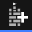
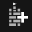

<div align="center">


# SeinARTS Framework

### _Professional Action-RTS Framework for Unreal Engine 5_

[](https://unrealengine.com)
[](LICENSE)
[](CHANGELOG.md)
[](https://phenomstudios.ca)

**A comprehensive, data-driven framework for creating professional Action-RTS games in Unreal Engine 5**

</div>

---

## 🎮 **Overview**

SeinARTS Framework is a complete, production-ready solution for developing Action Real-Time Strategy games. Built with industry best practices and leveraging Unreal Engine's Gameplay Ability System (GAS), it provides everything you need to create engaging RTS experiences with minimal code.

### ✨ **Core Philosophy**

- **Data-Driven Design**: Configure units, abilities, and technologies through assets, not code
- **GAS Integration**: Full GameplayAbilitySystem support for scalable ability management
- **Production Ready**: Optimized for multiplayer with proper replication and networking
- **Designer Friendly**: Intuitive workflows and visual tools for rapid iteration

---

## 🚀 **Key Features**

### 📦 **Core Systems**

<table>
<tr>
<td width="50%">

####  **Unit & Actor Framework**

- **Data Asset-Driven Units**: Configure units entirely through data assets
- **Multi-Type Support**: Infantry, vehicles, buildings, and custom unit types
- **Formation System**: Advanced formation management with spacing and positioning
- **Selection System**: Intuitive selection with marquee and single-click support

</td>
<td width="50%">

####  **Production & Economy**

- **Queue-Based Production**: Multi-item production queues with priority handling
- **Resource Management**: 12-slot resource system with flexible configuration
- **Cost Calculation**: MMC-based dynamic cost calculations
- **Technology Integration**: Production unlocks through research trees

</td>
</tr>
<tr>
<td width="50%">

####  **Technology System**

- **Research Trees**: Complex technology dependencies and unlocks
- **Unit Modifications**: Technology-based unit stat modifications
- **Ability Unlocks**: Conditional ability access through research
- **GAS Integration**: Full GameplayEffect-based technology system

</td>
<td width="50%">

####  **Order & Command System**

- **Intuitive Controls**: Right-click ordering with drag support
- **Formation Orders**: Group movement with formation preservation
- **Queue Management**: Order queuing with shift-click support
- **Event-Driven**: GAS gameplay event-based order execution

</td>
</tr>
</table>

### 🎯 **Gameplay Features**

#### **Player Management**

- **Multi-Player Support**: Full networked multiplayer with proper replication
- **Team System**: Configurable teams with friendly/enemy detection
- **Player State Integration**: Centralized player data management
- **Camera System**: RTS-style camera with smooth movement and controls

#### **Combat & Abilities**

- **GAS-Powered Abilities**: Industry-standard ability system integration
- **Resource-Based Costs**: Optional player resource costs for strategic abilities
- **Flexible Triggering**: Event-based ability activation with gameplay tags
- **Blueprint Friendly**: Easy-to-extend ability blueprints

---

## 🛠️ **Development Tools**

###  **Editor Integration**

The framework includes comprehensive editor tools to streamline development:

#### **Asset Factories**

- **One-Click Creation**: Integrated asset creation through Content Browser
- **Template Support**: Pre-configured templates for common asset types
- **Validation**: Built-in validation for asset configuration

#### **Development Dialogs**

- **Quick Setup**: Guided dialogs for rapid asset configuration
- **Batch Operations**: Multi-asset operations for efficient workflows
- **Preview Support**: Real-time preview of configurations

#### **Visual Tools**

- **Formation Visualization**: Visual formation editing and preview
- **Technology Trees**: Interactive technology dependency visualization
- **Debug Overlays**: Comprehensive debugging tools and visual feedback

---

## 📋 **Requirements**

### **Engine Version**

- **Unreal Engine 5.3+** (Required)
- **GameplayAbilities Plugin** (Auto-enabled)
- **ModelingToolsEditorMode Plugin** (Auto-enabled)

### **Development Environment**

- **Visual Studio 2022** (Windows)
- **Xcode 14+** (macOS)
- **C++17 Compiler Support**

### **Target Platforms**

- ✅ **Windows** (DirectX 11/12, Vulkan)
- ✅ **macOS** (Metal)
- ✅ **Linux** (Vulkan)
- 🔄 **Consoles** (Contact for availability)

---

## 🚀 **Quick Start**

### 1. **Installation**

```bash
# Clone or extract to your project's Plugins folder
Plugins/SeinARTS_Framework/
```

### 2. **Project Setup**

1. Enable the **SeinARTS_Framework** plugin in your project
2. Regenerate project files if using C++
3. Restart Unreal Editor

### 3. **Create Your First Unit**

1. Right-click in Content Browser → **SeinARTS** → **Unit Asset** 
2. Configure unit properties in the asset editor
3. Place units in your level or spawn through production

### 4. **Setup Game Framework**

1. Create Blueprints based on SAF classes:
   - **GameMode**: `ASAFGameMode`
   - **PlayerController**: `ASAFPlayerController`
   - **PlayerState**: `ASAFPlayerState`
   - **HUD**: `ASAFHUD`

---

## 📚 **Documentation**

### **Core Concepts**

- [**Data Asset System**](docs/DataAssets.md) - Understanding the data-driven approach
- [**Unit Framework**](docs/Units.md) - Creating and configuring units
- [**Production System**](docs/Production.md) - Resource management and production
- [**Technology Trees**](docs/Technology.md) - Research and progression systems

### **Advanced Topics**

- [**GAS Integration**](docs/GameplayAbilities.md) - Working with the Gameplay Ability System
- [**Networking**](docs/Networking.md) - Multiplayer implementation
- [**Performance**](docs/Performance.md) - Optimization best practices
- [**Customization**](docs/Customization.md) - Extending the framework

### **API Reference**

- [**C++ API Documentation**](docs/api/) - Complete C++ class reference
- [**Blueprint API**](docs/blueprints/) - Blueprint node reference
- [**Asset Types**](docs/assets/) - Data asset schema reference

---

## 🤝 **Support & Community**

### **Getting Help**

- 📖 **[Documentation Hub](docs/)** - Comprehensive guides and tutorials
- 💬 **[Discord Community](https://discord.gg/phenomstudios)** - Live support and discussion
- 🐛 **[Issue Tracker](https://github.com/RJPhenom/SeinARTS/issues)** - Bug reports and feature requests
- 📧 **[Direct Support](mailto:support@phenomstudios.ca)** - Professional support options

### **Contributing**

We welcome contributions from the community! Please see our [Contributing Guidelines](CONTRIBUTING.md) for details on:

- Code standards and style
- Testing requirements
- Pull request process
- Feature proposal process

---

## 📄 **License**

SeinARTS Framework is proprietary software developed by **Phenom Studios**.

For licensing inquiries, please contact: [licensing@phenomstudios.ca](mailto:licensing@phenomstudios.ca)

---

## 🏢 **About Phenom Studios**

<div align="center">

**Creating exceptional game development tools and experiences**

[](https://phenomstudios.ca)
[](https://twitter.com/PhenomStudios)
[](https://linkedin.com/company/phenom-studios)

</div>

---

<div align="center">

**Built with ❤️ for the Unreal Engine community**

_© 2024 Phenom Studios. All rights reserved._

</div>
